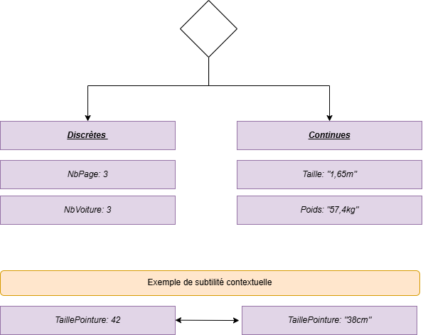
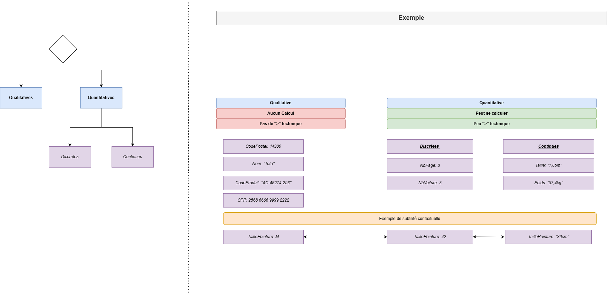

# Rappel sur les types de données

## Données qualitatives vs données quantitatives

En plus de savoir si une donnée est continue ou discrète, il est aussi important de distinguer **le type d'information** que cette donnée représente.

On distingue deux grands types :

- Les **données qualitatives**
- Les **données quantitatives**

### Données qualitatives

Les données qualitatives (aussi appelées **catégorielles**) décrivent **une qualité, une catégorie ou une caractéristique**. Elles ne sont **pas numériques**.

#### Exemples simples :

- La **couleur** d’une voiture : rouge, bleu, noir
- Le **type de produit** : alimentaire, électronique, textile
- Le **nom d’un pays** : France, Brésil, Japon

On ne peut **pas faire de calculs** avec ces données (pas d’addition, pas de moyenne…).

On peut parfois les classer (ex : petit, moyen, grand), on parle alors de **qualitatives ordinales**.

### Données quantitatives

Les données quantitatives sont des **valeurs numériques**. Elles expriment une **quantité** que l'on peut mesurer ou compter.

Elles peuvent être :

- **Discrètes** : nombre d’enfants, nombre de chaussures
- **Continues** : taille, poids, température

Avec ces données, on peut **faire des calculs** : moyennes, écarts, sommes, etc.

### Comment les différencier ?

| Question                           | Données qualitatives       | Données quantitatives       |
|-----------------------------------|-----------------------------|------------------------------|
| Donnée sous forme de texte ?      | Oui                         | Non                          |
| Peut-on faire des calculs ?       | Non                         | Oui                          |
| Exemples                          | Couleur, pays, catégorie    | Taille, poids, nombre        |

### À retenir

- **Qualitatives** : ce qu’on **décrit**
- **Quantitatives** : ce qu’on **mesure ou compte**

## Données continues vs données discrètes

Quand on travaille avec l'intelligence artificielle ou la science des données, il est essentiel de comprendre le type de données qu'on manipule. Cela influence comment on les analyse, les visualise, et même les prédit avec des modèles d’IA.

Il existe **deux grands types de données numériques** :

- Les **données discrètes**
- Les **données continues**

### Données discrètes

Les données discrètes sont des **valeurs que l’on peut compter**. Elles ne peuvent prendre que des valeurs spécifiques, souvent entières.

#### Exemples simples :

- Le **nombre d'enfants** dans une famille : 0, 1, 2, mais jamais 2,5
- Le **nombre de voitures** dans un parking : 15, mais jamais 15,3
- Le **nombre de pages** dans un livre : 100, 101, mais pas 100,5

On dit souvent que ce sont des données **finies et séparées**.

### Données continues

Les données continues sont des **valeurs que l’on peut mesurer**. Elles peuvent prendre **toutes les valeurs possibles dans un intervalle**, même des valeurs avec beaucoup de décimales.

#### Exemples simples :

- La **taille** d'une personne : 1,65 m, 1,752 m, etc.
- La **température** : 22 °C, 22,1 °C, 22,137 °C...
- Le **poids** d’un objet : 3,2 kg, 3,234 kg, etc.

Ce sont des données **infinies entre deux valeurs** : entre 1 et 2, on peut avoir 1,1 ; 1,01 ; 1,001, etc.

### Comment les différencier ?

| Question                          | Données discrètes       | Données continues        |
|----------------------------------|--------------------------|---------------------------|
| Peut-on les compter ?            | Oui                      | Non                       |
| Peut-on les mesurer précisément ?| Non                      | Oui                       |
| Sont-elles finies ou infinies ?  | Finies                   | Infinies dans un intervalle |
| Exemples                         | Nombre d’élèves, de livres | Taille, température, poids |

## À retenir

- Si on peut **les compter** : ce sont des données **discrètes**
- Si on doit **les mesurer** : ce sont des données **continues**

## Vulgarisation schéma global

