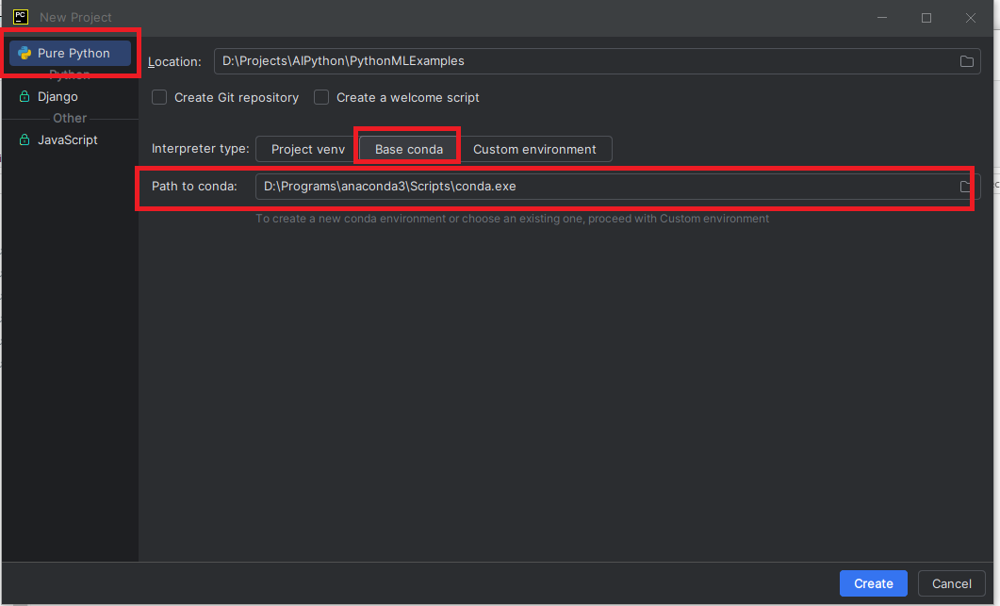
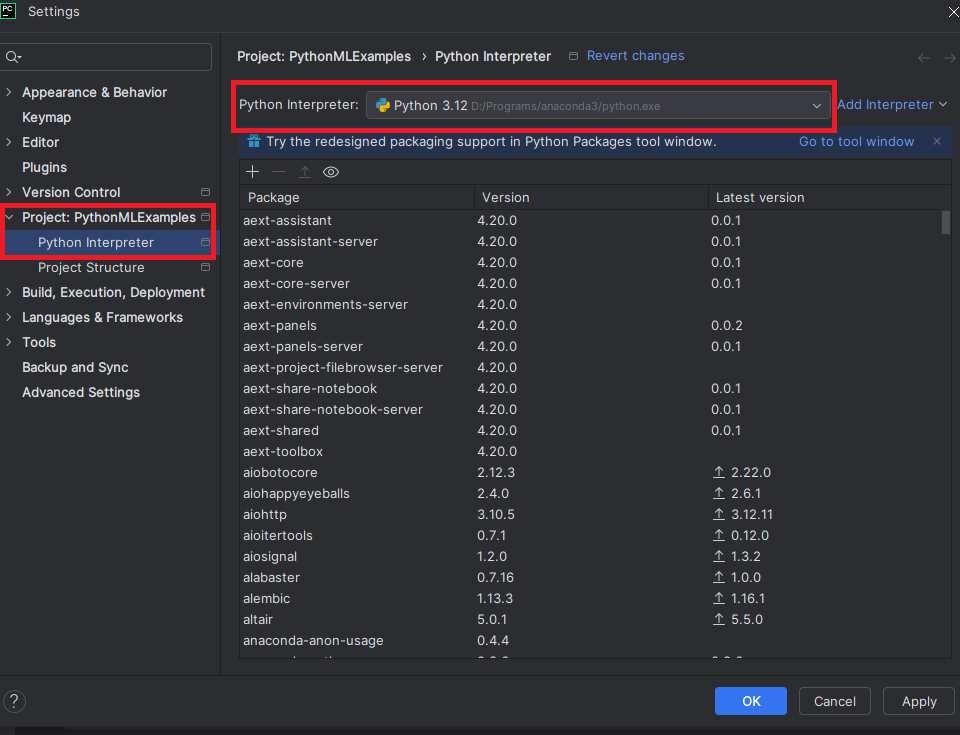

# Associer un environnement Conda

Lorsque vous créez un projet Python, il est **recommandé d'utiliser un environnement isolé**, afin de gérer les bibliothèques indépendamment des autres projets.

Dans ce guide, nous utilisons **Conda**, fourni avec **Anaconda**, pour créer et gérer ces environnements.

Voici comment associer un environnement Conda à votre projet dans **PyCharm**.



# Interpréteur Python

Pour exécuter vos scripts ou notebooks, votre projet doit être **lié à un interpréteur Python**.

Dans notre cas, nous allons sélectionner l’interpréteur Python de l’environnement Conda créé via Anaconda, ce qui nous permet de bénéficier des bibliothèques déjà installées.

Voici à quoi cela ressemble dans PyCharm :



## Résumé

- Créez un environnement Conda via Anaconda ou l’interface de PyCharm
- Associez cet environnement comme interpréteur du projet
- Vous pouvez désormais utiliser Python avec les bibliothèques scientifiques (NumPy, pandas, etc.) de façon isolée et reproductible

# Exemple de structure

Le projet peut être organisé selon les étapes classiques d’un pipeline de machine learning, dans un but d’apprentissage structuré.

```
mon_projet_ml/
├── notebooks/               # Notebooks Jupyter par étape du projet
│   ├── 01_exploration.ipynb
│   ├── 02_preprocessing.ipynb
│   ├── 03_model_training.ipynb
│   └── 04_evaluation.ipynb
│
├── data/                   # Données utilisées pour l’analyse
│   ├── raw/                # Données brutes (non modifiées)
│   └── processed/          # Données nettoyées et transformées
│
├── models/                 # Modèles sauvegardés (.pkl, .joblib)
│   └── model.pkl
│
├── src/                    # Code source réutilisable (fonctions Python)
│   ├── __init__.py
│   ├── preprocessing.py
│   ├── train.py
│   └── evaluate.py
│
├── requirements.txt        # Dépendances Python à installer
├── README.md               # Description du projet et des étapes
```

## Exemple de `requirements.txt`

```txt
jupyter
numpy
pandas
scikit-learn
matplotlib
seaborn
```

## Exemple de contenu pour `01_exploration.ipynb`

```python
import pandas as pd
import seaborn as sns
import matplotlib.pyplot as plt

# Charger les données
df = pd.read_csv("../data/raw/mon_dataset.csv")

# Informations générales
df.info()
df.describe()

# Visualisation exploratoire
sns.pairplot(df)
plt.show()
```

## Bonnes pratiques

- Conserver les données brutes inchangées dans `data/raw`
- Centraliser le code Python réutilisable dans `src/`
- Documenter chaque notebook pour garder une logique pédagogique claire
