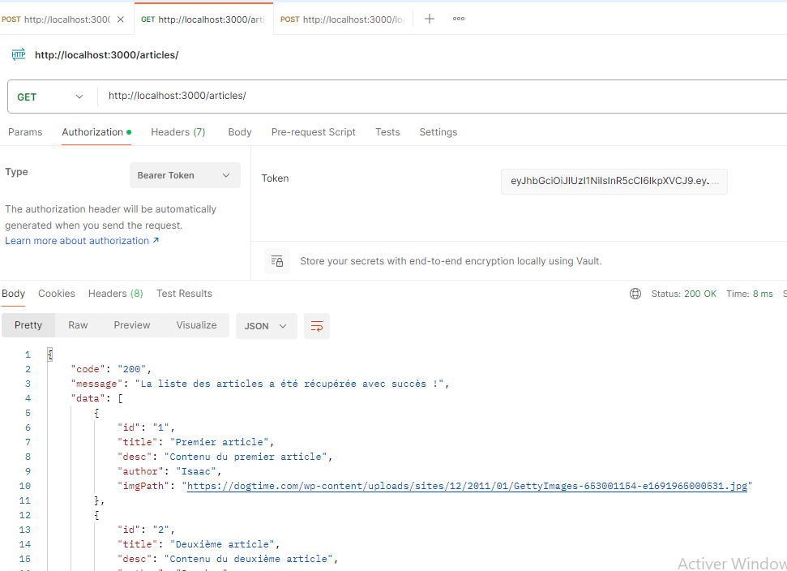

# TP Android - Partie 06 (Plus)

> **Durée estimée : indéterminée (3h)**

## Énoncé

Vous allez à présent modifier le back local afin d’injecter les *middlewares* qui vérifient si l’utilisateur est authentifié via le token JWT (*Bearer Token*).

Exemple pour injecter le middleware côté back sur l’URL qui récupère tous les articles (`middlewareVerifyToken`) :

```js
const { middlewareVerifyToken } = require('../core/middlewares');

...

/**
 * Route GET : Pour récupérer tous les articles
 */
router.get("/", middlewareVerifyToken, async (request, response) => {
    // Récupérer une liste/tableau d’articles
    const articles = DB_Articles;

    // Retourner les articles dans la réponse JSON
    return httpApiResponse(
        response,
        "200",
        "La liste des articles a été récupérée avec succès !",
        articles
    );
});
```

### Exemple d’utilisation côté Postman



Le but du TP est donc, côté mobile, de **stocker le token en cache** lorsque vous êtes connecté(e), afin de pouvoir envoyer ce token dans le header des requêtes nécessitant une authentification  
(c’est à vous de placer le middleware côté back puisque ce TP est un TP bonus).

Étant donné que c’est un TP « plus plus », il faut tester ce qui se passe si le token est **expiré** ou **invalide**, côté mobile/front, de manière *user-friendly*.

Exemple :

- Si le token est expiré → afficher une popup indiquant qu’il faut se reconnecter, puis rediriger vers la page de connexion.
- Si on arrive sur la page article avec un mauvais token → redirection vers la page login, puisque de toute façon l’API renverra une erreur métier.
