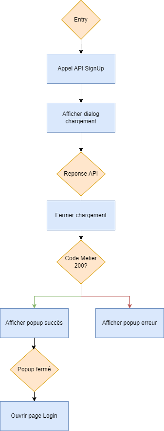
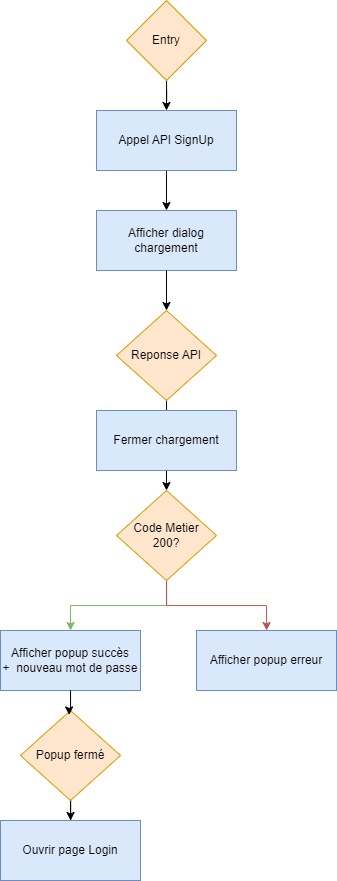

# TP Android - Partie 06

> **Durée Estimée : Indeterminée (4h) **

## Enoncé

Connectez vos pages de Connexion, d'Inscription et de Réinitialisation de mot de passe avec notre API Backend.

:::warning Localhost du serveur

L'api sera appelé sur le **localhost**

Dans tout les cas port **3000**

Les ip possibles selon votre cas :

- 127.0.0.1 : Localhost du pc en port fowarding
- 10.0.2.2 : Sur emulateur avec le security-config 
- 10.0.0.2 : Sur un autre emulateur sans security-config
- etc..

:::

## Ressources

Pour la doc retrofit vous pouvez consulter : https://square.github.io/retrofit/

### Connexion

Votre endpoint /auth retourne les informations nécessaires à la page de Connexion.

#### Donnée à envoyer (Dans le Body)

- email
- password

:::info Compte existant

- email: isaac@gmail.com
- password: password

:::

Lorsqu'une connexion est valide, l'API retourne :

- code 200
- le message
- data : le token

Donc, quand c'est le cas, stocker le token en cache et afficher une popup qui affiche le message de l'API.
Lorsque la popup se ferme, ouvrir la page des articles.

#### Diagram de séquence

### Inscription

Votre endpoint /signup retourne les informations nécessaires à la page d'Inscription.

#### Donnée à envoyer (Dans le Body)

- un user avec au moins un email et password

Lorsque l'inscription est valide, l'API retourne :

- code 200
- un message
- data : l'utilisateur créé

Lorsque la popup se ferme, ouvrir la page de Connexion.

#### Diagram de séquence

### Mot de passe oublié

Votre endpoint /reset-password retourne les informations nécessaires à la page de réinitialisation de mot de passe.

#### Donnée à envoyer (Dans le Body)

- email

Lorsque la réinitialisation du mot de passe est valide, l'API retourne :

- code 200
- un message
- data : le nouveau mot de passe

Lorsque la popup se ferme, ouvrir la page de Connexion.

#### Diagram de séquence

:::warning Sécurité

Attention, ici nous affichons le nouveau mot de passe dans le cadre du TP, mais évidemment, dans une vraie application, il aurait fallu envoyer un mail contenant le nouveau mot de passe pour laisser à l'utilisateur la possibilité de changer son mot de passe lui-même.

:::