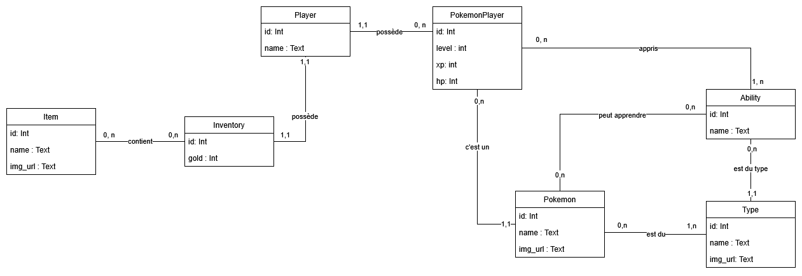

# TP 1 - Découverte du SQL

## Objectif du TP

L’objectif de ce TP est de découvrir et pratiquer les bases du SQL à travers la modélisation et la manipulation d’une base de données inspirée d’un jeu Pokémon.

À la fin du TP, les étudiants devront être capables :
- de comprendre un schéma de base de données relationnelle,
- de créer des tables avec des clés primaires et étrangères,
- de gérer des relations (1,n) et (n,n),
- d’insérer des données de test,
- d’écrire des requêtes SQL simples pour interroger les données.

## Contexte

Voici une vulgarisation du schéma de base de données (sans les clés étrangères ni les tables d’association explicites) :

Le but est de commencer à modéliser une première partie de la base de données permettant de stocker :
- les Pokémon existants,
- les Pokémon possédés par un joueur,
- les compétences,
- l’inventaire d’un joueur.

La finalité du projet sera, dans un TP ultérieur (ou démo si pas assez de temps), de créer :
- un microservice backend en Node.js,
- un frontend permettant d’afficher et de modifier les données.

## Quelques points importants

- **Pokemon**  
  Cette table représente les types ou espèces de Pokémon existants dans le jeu.  
  Exemple : Salamèche, Carapuce, Bulbizarre.

- **PokemonPlayer**  
  Cette table représente un Pokémon possédé par un joueur.  
  Si un joueur possède deux Salamèche, on ne duplique pas deux fois les données de Salamèche dans la table `Pokemon`.  
  On crée deux entrées dans `PokemonPlayer` qui référencent le même Pokémon.

- Un Pokémon peut apprendre plusieurs compétences.
- Le Pokémon d’un joueur peut apprendre des compétences (maximum 4, règle métier).

## Exemple de relation

- **POKEMON (1,n) — apprend — (0,n) ABILITY**

### Lecture correcte de la relation

- Côté **Ability (0,n)**  
  - Un Pokémon peut apprendre de 0 à n compétences.

- Côté **Pokemon (1,n)**  
  - Une compétence peut être apprise par 1 à n Pokémon.

## Travail demandé

Vous devez écrire les scripts SQL suivants, chacun dans un fichier séparé :

1. **Script de nettoyage de la base de données**
   - Supprimer et recréer la base de données  
   **ou**
   - Supprimer/nettoyer les tables une par une.

2. **Script de création des tables principales**
   - Création des tables de base.
   - Définition des clés primaires.
   - Définition des clés étrangères.

3. **Script de création des tables d’association**
   - Tables pour les relations de type (n,n).

4. **Script d’insertion de données de test**
   - Insérer des données simples.
   - Exemple : 3 Pokémon, quelques compétences, un joueur, un inventaire minimal.

5. **Script de test (requêtes SQL)**  
   Les requêtes doivent permettre de :
   - Récupérer les Pokémon d’un joueur.
   - Récupérer un Pokémon spécifique d’un joueur.
   - Récupérer les compétences qu’un Pokémon peut apprendre.
   - Récupérer les compétences apprises par le Pokémon d’un joueur.
   - Récupérer le type d’un Pokémon appartenant à un joueur.
   - Récupérer un item spécifique dans l’inventaire d’un joueur.
