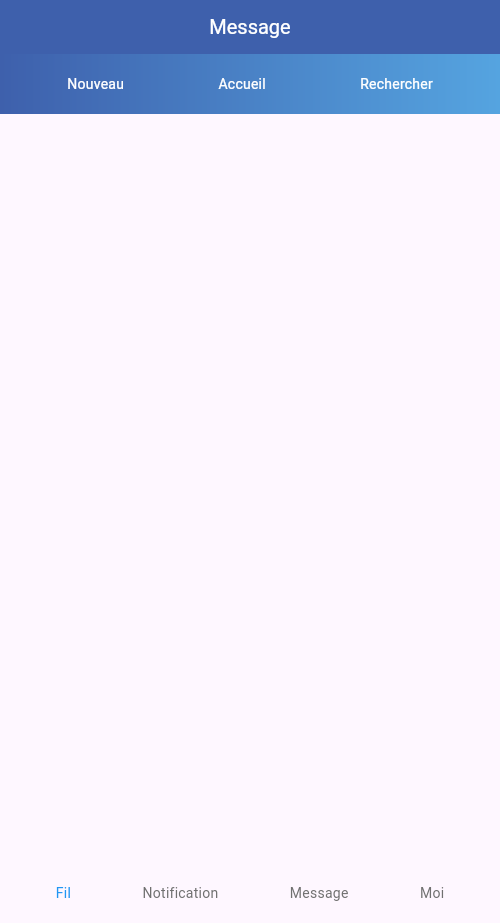

# TP Twitter - Partie 01

> **Durée Estimée : 2h**

## Enoncé

Créer un nouveau projet Flutter.

L’objectif est de commencer à reproduire l’interface du fil d’actualité de Twitter.

Il est recommandé de créer vos Widgets personnalisés pour une meilleur gestion.

Créer une barre des boutons dans laquelle on retrouve un texte
« Nouveau » aligné à gauche, un texte « Accueil » centré et un texte
« Rechercher » aligné à droite.

La couleur de fond de la barre doit être égale à `#58B0F0`.

Un padding doit être positionnée dans la barre des boutons et 25 unités
en haut et en bas.

:::info Couleur

- Les couleurs en hexadécimal s'ecrivent ainsi : `Color(0xFF55a4e0)`
- Si vous souhaitez mettre des couleurs dégradées comme dans la maquette voir : https://api.flutter.dev/flutter/painting/LinearGradient-class.html

:::

Ajouter une zone vide pour le moment (cela peut être un Container)
dans laquelle pourront figurer les actualités.

Cette zone doit prendre l’intégralité de la hauteur et de la largeur
restantes à l’écran.

Ajouter une barre de boutons en bas de l’écran qui va recevoir quatre
zones de texte : Fil, Notifications, Messages et Moi.

Ces zones se répartissent équitablement l’espace disponible en largeur.

Créer une carte comportant trois zones qui se suivent verticalement :
une première zone avec le contenu du tweet, une deuxième avec trois
textes (Répondre, Retweet et Favoris).

Dans la zone de contenu, afficher une image de 125 d’unités de large
et un bloc comprenant le nom de l’auteur, son identifiant et la date
du post. En dessous de ce dernier bloc figure le texte.

