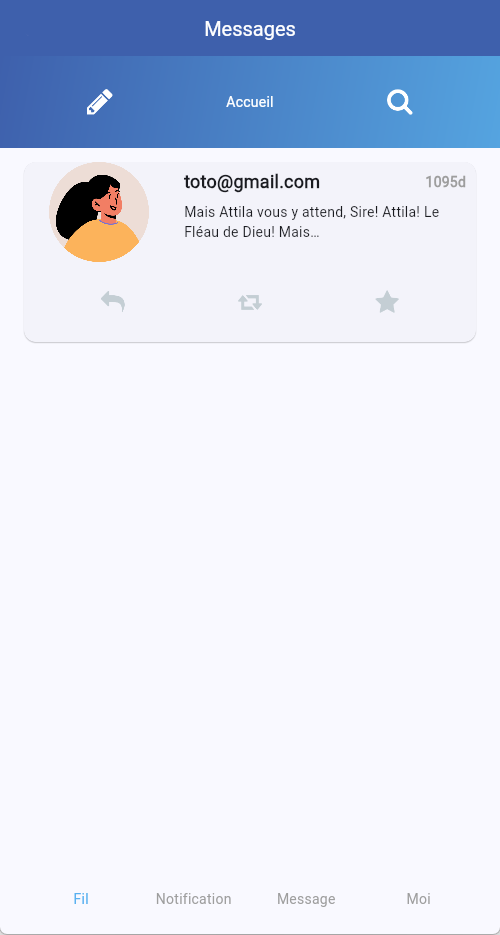
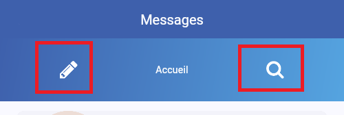
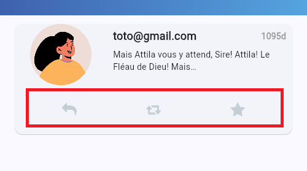

# TP Twitter - Partie 02

> **Durée Estimée : 30min**

## Enoncé

Reprendre le corrigé du TP précédent et charger le projet dans votre IDE.

L’objectif est de compléter l’interface du fil d’actualité avec des images, des boutons et 
de la mise en forme. Vous pouvez commencer à imprimer votre propre patte graphique.

Les textes **Rechercher** et **Nouveau** sont remplacés par des 
**IconButton**. 
Pensez à bien intégrer les images **search.png** et 
**pencil.png** aux projets natifs pour que cela fonctionne.

De la même manière, remplacer les boutons **Répondre**, **Retweet**
et **Favoris** par des **IconButton**

## Card

L'effet que vous voyez sur la capture d'écran est le composant **Card**. 

## Dégradé

Pour le dégradé, au lieu d'utiliser une couleur unie, vous pouvez utiliser un BoxDecoration qui peut prendre le paramètre gradient

