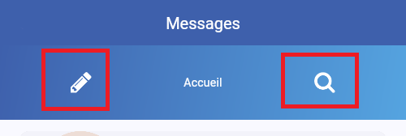

# TP Twitter - Partie 03

> **Durée Estimée : 1h**

## Enoncé

Reprendre le corrigé du TP précédent et charger le projet dans votre IDE.

Nous allons à présent créer une autre page qui servira de page de connexion. La page peut ressembler globalement à ceci :


Vous avez toute liberté créative, vous pouvez changer le design, les couleurs, etc., sans aucun problème !

Il faudra intégrer les validateurs comme vu dans les démos.

La page par défaut (le home ou le initialRoute) sera la page de connexion, et la route 
(« tweet-list-page » par exemple) pour la page associée au tweet.


:::warning Attention

Le widget **Scaffold** est synonyme d’une page (chacune de vos pages vont posséder un 
**Scaffold** au premier niveau). 

Attention à ne pas utiliser plusieurs fois le **MaterialApp**. 

Le **MaterialApp** va servir de « router » et contenir les routes associées aux pages

:::

## Débutant

Dans un premier temps, vous pouvez simplement créer la page de connexion sans thème personnalisé et sans icône.

- Uniquement un titre
- Champ pour l'email et le mot de passe
- Option pour se souvenir des informations
- Bouton de connexion"




De la même manière, remplacer les boutons **Répondre**, **Retweet**
et **Favoris** par des **IconButton**


## Astuces

### Theming

Pour le theming, vous pouvez créer une classe nommée par exemple **AppTheme** qui va contenir des valeurs et des fonctions statiques pour stocker les styles, les couleurs, etc.

Voici un exemple de code que je peux écrire de mon côté :

`app-theme.dart`

```dart
import 'package:flutter/material.dart';

import 'i18n/language-dialog.dart';

class AppTheme {
  static const textFieldFillColor = Color(0xEEd3dce9);
  static const highlightTextColor = Color(0xFFcce7f3);

  static var primaryGradientDecoration = const BoxDecoration(
    gradient: LinearGradient(
      begin: Alignment.topLeft,

      ...
```