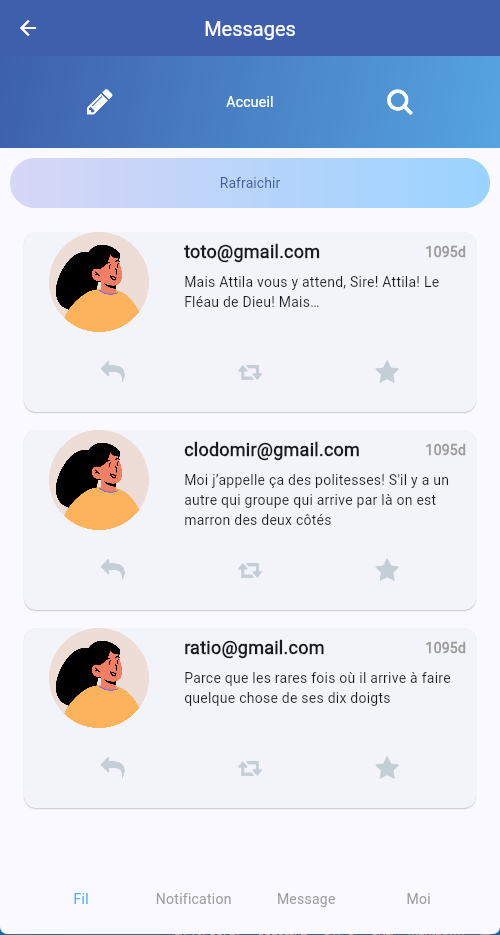

# TP Twitter - Partie 04

> **Durée Estimée : 1h**

## Enoncé

A partir du TP Twitter, ajouter l’appel web service pour récupérer une liste de tweet via cette url :
- https://raw.githubusercontent.com/Chocolaterie/EniWebService/main/api/tweets.json

Exemple de résultat attendu :

Étapes :

- Créez le modèle/classe Tweet avec les attributs en accord avec le web service.
- La page qui affichait le Tweet doit maintenant être Stateful puisqu’on va recharger la vue selon le retour de l’API.
- Importez les dépendances nécessaires dans le fichier pubspec.yaml pour exploiter l’API (le module http).
- Faites le mappage du JSON en objet Tweet manuellement.
- Appelez l’API lors du clic sur un bouton « Rafraîchir » dans la page de tweet.
- Une fois les données récupérées, n'oubliez pas d'utiliser setState pour mettre à jour la ListView (que vous aurez également créée).
`
## JSON Serializable

Si vous utiliser la lib `json_serializable` n'oubliez pas qu'une fois votre modèle développé, il faut régénérer la classe qui contiendra les fonctions de mapping JSON à l'aide de : 

`flutter pub run build_runner build

## Pour aller plus loin

- Afficher une « dialog box » (comme dans la démo, la lib sn_progress_dialog) lors de 
l’appel de l’API et la fermer une fois que le traitement est terminé
- Utiliser la lib json_serializable pour faire la Mapping automatiquement avec du code 
générer
- Chercher un moyen d’appeler l’API par défaut lorsqu’on arrive sur la page (pas besoin de cliquer sur le bouton)