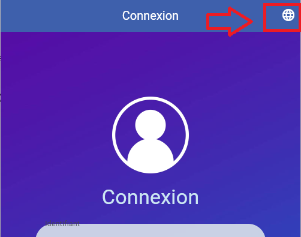
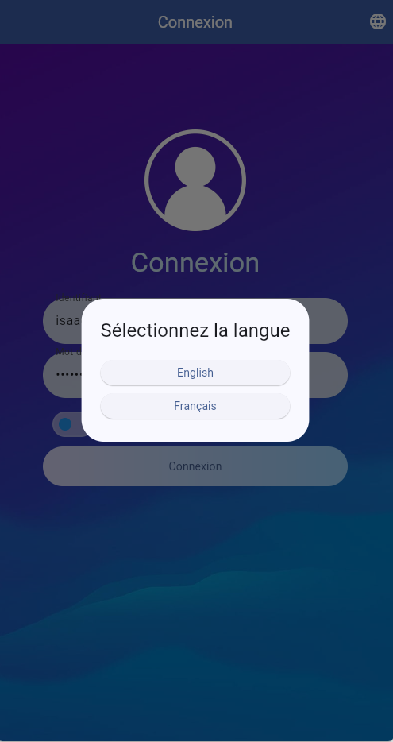

# TP Twitter - Partie 05

> **Durée Estimée : 30min-1h**

## Enoncé

Ajoutez la localisation à l'application pour pouvoir avoir :

- Le français
- L'anglais

Vous utiliserez la librairie localization (simplifie la tâche) : https://pub.dev/packages/localization

## Bouton dans AppBar

Vous devrez ajouter un bouton dans l'AppBar pour pouvoir afficher une boîte de dialogue qu ivous permeettra de choisir la langue

La boîte de dialogue en question :

