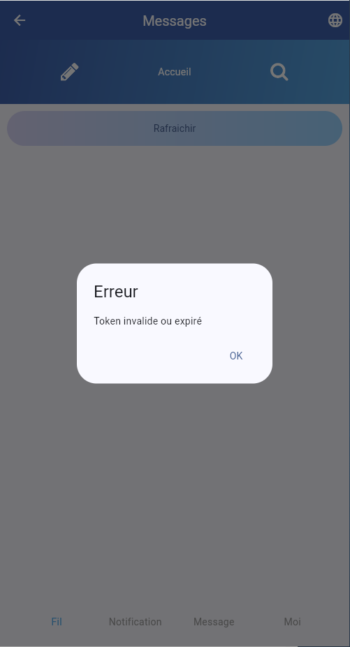
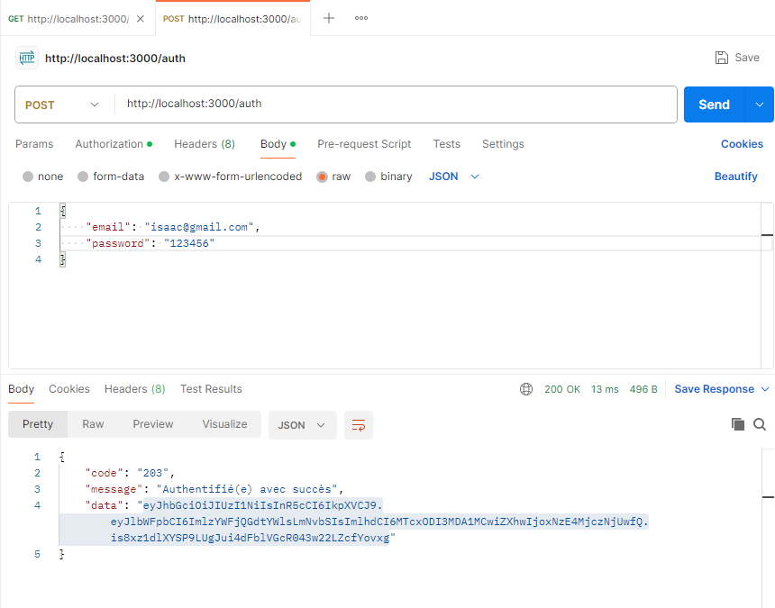
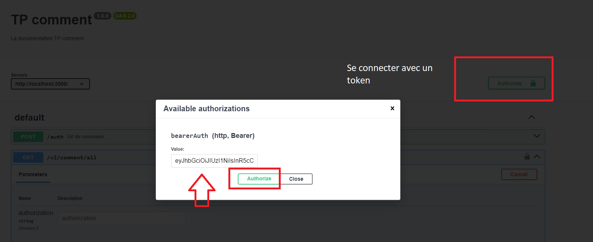
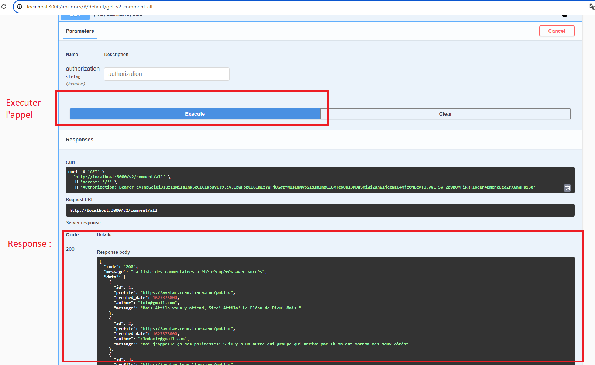
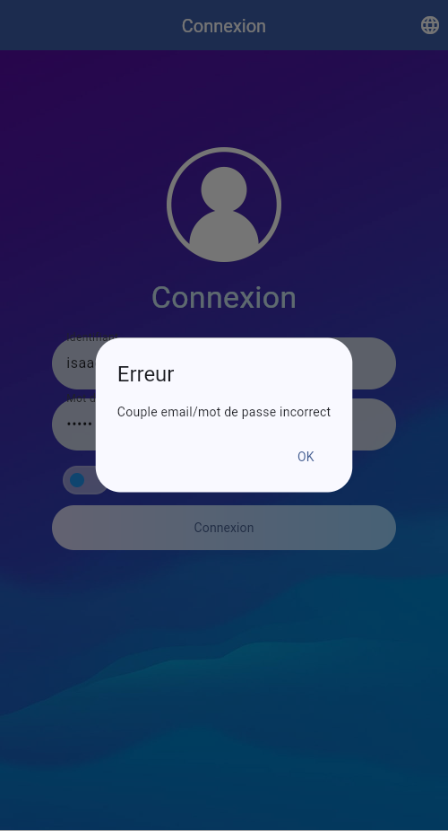

# TP Twitter - Partie 05

> **Durée Estimée : 1h**

## Enoncé

Il convient d'avoir suivi la démo sur les APIs et l'exploitation de notre propre API Node.js avec des tokens pour le TP.

Dorénavant, nous allons utiliser notre propre API backend en local pour récupérer les tweets et compléter les quatre écrans, y compris la page de connexion.

Dans l'API backend fournie, la connexion génère un token JWT d'une durée d'une heure et les points d'entrée comme la récupération des tweets nécessiteront ce token, donc certaines routes seront protégées par authentification.

Par exemple, si j'accède à la page des tweets sans être connecté et que j'appelle le service :

## Postman

Si vous voulez comprendre comment fonctionne une API qui vous est fournie, il convient de tester les points d'entrée sur Postman ou via Swagger s'il existe.

Exemple de requête de connexion à l'API avec Postman :

Exemple de requête de connexion à l'API avec Swagger :

Connexion jwt avec swagger

Appel d'une route

## Login

Les comptes mock :
- isaac@gmail.com | 123456
- denis@gmail.com | 123456
- chocolatine@gmail.com | password

Pour la connexion l'api:

- POST: `http://127.0.01:3000/auth`
- vous devez envoyer dans le request body :
    - email
    - password

### Coupe email mot de passe incorrect

Si les informations ne sont pas correctes

### Connexion correcte

Si les informations sont correctes :
- Le token retourné par l'API devra être stocké dans Flutter par divers moyens (par exemple, dans un singleton, une variable statique ou un cache, à vous de choisir).
- À chaque fois que vous allez appeler une API sécurisée, vous enverrez le token dans l'en-tête "Authorization" de la requête HTTP depuis Flutter, en utilisant le schéma Bearer Token.
- Redirigez vers la page des commentaires/tweets

## Les commentaires/tweets

Si vous êtes connecté, dans la page qu iaffiche les commentaires l'entrypoint est :

- GET: `http://127.0.01:3000/v2/comment/all`
- Envoyer le token dans le header bearer token

