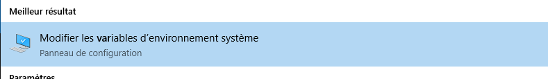
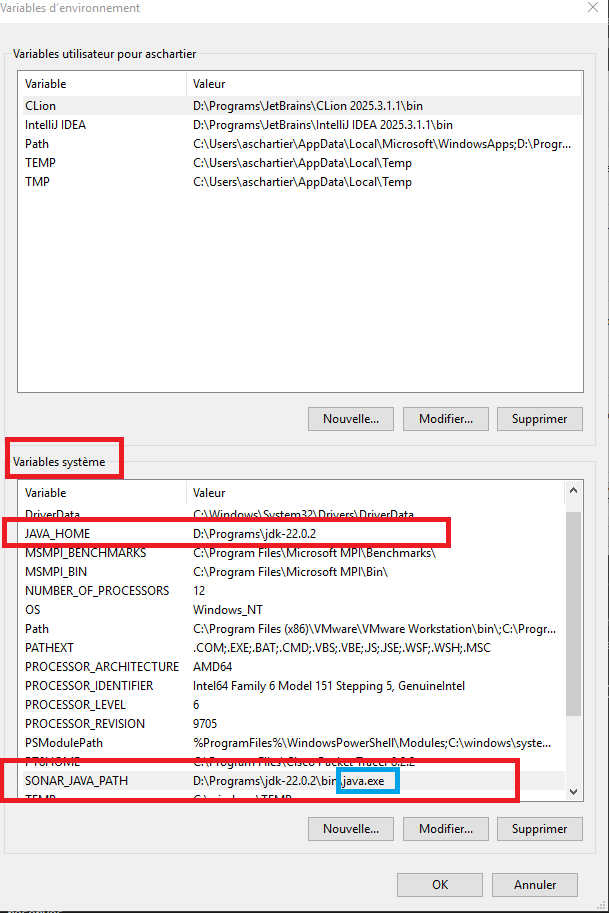
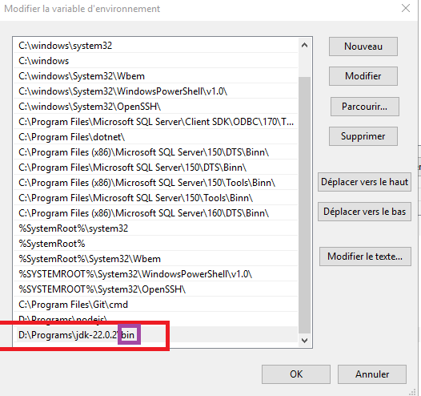

# Sonar

Nous verrons une utilisation vulgarisée et classique de SonarQube et Sonar Scanner, entièrement en local (localhost), afin de comprendre d'abord son fonctionnement natif.

## SonarQube

SonarQube est un ensemble de solutions pour l'analyse de code, développé en Java. Par conséquent, il est nécessaire d'installer Java (version 11 minimum). Vous pouvez tester SonarQube en local (localhost) après installation.

Lien de téléchargement : https://www.sonarsource.com/products/sonarqube/downloads/

Décompressez-le à l'emplacement souhaité et lancez l'exécutable correspondant à votre plateforme.

## Configurer Java

### Les variables

JAVA_HOME = La racine d'un dossier jdk

Exemple sur intellij il telecharge vos jdk ici : `C:\Users\aschartier\.jdks`





### Path

Ouvrir le path :


Deux choses :
- Supprimer les versions de java inutilisées (ex: 8,9, 11) si étaient la par défaut
- Ajouter votre chemin java sdk (mais le bin du dossier )


:::warning Attention

Dans le path c'est le bin du dossier, ex: `D:\Programs\jdk-22.0.2\bin`

:::

## Start
Par exemple, sous Windows, il faut lancer le script StartSonar.bat situé dans le dossier bin/windows-x86-64.

```
StartSonar.bat
```

Cela peut prendre quelques minutes. Une fois prêt, vous pouvez accéder à l'interface d'administration via le port par défaut 9000 (http://localhost:9000).

Les identifiants de connexion par défaut sont :
    - Nom d'utilisateur : admin
    - Mot de passe : admin

Remarque importante : SonarQube ne scanne pas directement le code. Pour cela, vous devrez utiliser un autre outil appelé Sonar Scanner.

### Token SonarQube

Il faut créer un projet dans SonarQube pour générer ensuite un **token**, qui nous sera utile par la suite.

## Sonar Scanner

Vous devez télécharger Sonar Scanner, puis il est recommandé de l'ajouter à la variable d'environnement Path de votre système pour pouvoir l'utiliser globalement en ligne de commande.

Lien de téléchargement : https://docs.sonarsource.com/sonarqube/9.7/analyzing-source-code/scanners/sonarscanner/

En général, l'outil Sonar Scanner se trouve dans le dossier /bin. En spécifiant ce dossier dans la variable Path, vous pourrez utiliser la commande sonar-scanner directement depuis n'importe quel répertoire.

```
sonar-scanner
```

Cela vous permettra d'analyser facilement votre code source avec SonarQube.

## Analyser un projet

Il faut exécuter la commande sonar-scanner depuis la racine de votre projet contenant le code.

Vous avez deux choix :
- Exécuter la commande avec tous les paramètres en ligne de commande (cmd)
- Exécuter la commande avec un fichier sonar-project.properties situé dans la racine du projet

### Avec sonar-project.properties

Exemple avec un fichier sonar-project.properties :

```
sonar.projectKey=mon-projet
sonar.sources=src
sonar.host.url=http://localhost:9000
sonar.login=monjeton
```

- sonar.sources : Le dossier qui contient le code à analyser de manière récursive
- sonar.login : Le token généré via votre interface d'administration SonarQube

Enfin lancer le scan :

```
sonar-scanner
```