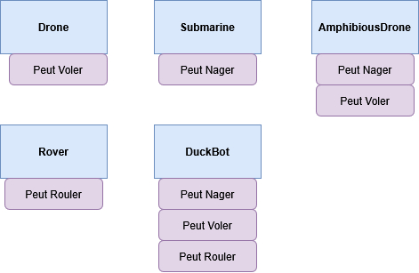

# TP Java – Interfaces (1)

## Objectif

- Écrire un programme **qui ne peut pas être réalisé avec l'héritage de classe seul** (Java interdit l'héritage multiple, plus précisement plusieurs **extends** sur la même classe), mais qui fonctionne **grâce aux interfaces**.  
- On modélise des **capacités orthogonales** (voler, nager, rouler) que certains robots peuvent cumuler.

---

Durée estimée : 1/2 heure(s)

## Idée clé

- Avec l'héritage classique (`extends`), une classe **ne peut avoir qu'un seul parent**.  
- Ici, un robot peut **cumuler plusieurs capacités** (voler **et** nager **et** rouler).  
- **Impossible** en héritage de classes seules → **nécessaire** d'utiliser des **interfaces**.


## Étape 1 - Définir les interfaces de capacités

L'objectif de cette première étape est de modéliser des **capacités indépendantes** :  
- une capacité à **voler**,  
- une capacité à **nager**,  
- une capacité à **rouler**.

Ces capacités seront représentées sous forme **d'interfaces**, afin que différents types de robots puissent **cumuler plusieurs comportements**.


### Consignes

- Créez trois fichiers Java séparés :  
   - `Flyable.java`  
   - `Swimmable.java`  
   - `Drivable.java`

- Dans chaque fichier, déclarez une **interface publique** contenant **une seule méthode abstraite** :
   - cette méthode représente **l'action principale** de la capacité (voler, nager, ou rouler).

- Ne mettez **aucun attribut** ni **code d'implémentation** à l'intérieur des interfaces.

Créez trois fichiers d'interface : `Flyable.java`, `Swimmable.java`, `Drivable.java`.


## Étape 2 - Implémentations concrètes (robots)

Objectif : créer plusieurs classes de robots qui **implémentent** les interfaces de **l'étape 1**, avec la possibilité pour un même robot de **cumuler plusieurs capacités**.

### Consignes

- Créez au moins **trois classes** de robots mono-capacité (ex. un robot qui vole, un qui nage, un qui roule).  
   - Chaque classe **implémente exactement une interface** parmi celles définies à **l'étape 1**.  
   - Chaque robot possède un **identifiant immuable** (ex. `id` passé par le constructeur).

- Créez au moins **une classe multi-capacités** (implémente **au moins deux** interfaces).  
   - Le but est de **démontrer le cumul** de capacités impossible via héritage multiple, mais **possible** grâce aux **interfaces**.

- Dans chaque classe :
   - Ajoutez un **constructeur** qui initialise l'identifiant.  
   - Implémentez **chaque méthode** de l'interface correspondante en produisant une **sortie console** explicite. 
   
        Exemple: `System.out.println("Drone " + id + " décolle et vole.");`
   - Ne mettez **aucune** logique réseau/IO ni temporisation : gardez des effets **simples et observables** (impressions console).  

### Visualisation 

Proposition visuelle des robots :



## Étape 3 - Contrôleur polymorphe (utilise **uniquement** les interfaces)

**But de l'étape**  
Écrire une classe de "contrôle" qui orchestre des actions **sans connaître les classes concrètes** des robots.  
Elle ne manipule que des **types d'interface** (`Flyable`, `Swimmable`, `Drivable`).

### Consignes

- Créez une classe `MissionControl` dans un fichier `MissionControl.java`.
- Déclarez **trois méthodes publiques et statiques** :
   - une qui déclenche **le vol** pour une liste d'objets `Flyable`,
   - une qui déclenche **la nage** pour une liste d'objets `Swimmable`,
   - une qui déclenche **le roulage** pour une liste d'objets `Drivable`.
- Chaque méthode :
   - reçoit en **paramètre** une liste typée par **l'interface** correspondante (ex. `List<Flyable>`),
   - **itère** sur cette liste (boucle for),
   - **appelle la méthode de l'interface** (ex. `fly()`), **sans cast** et **sans instanceof**,
   - ne fait **aucune hypothèse** sur la classe concrète (pas de `new` d'un robot ici, pas de références à `Drone`, `Rover`, etc.).
- La classe `MissionControl` ne doit **dépendre que** des interfaces de l'étape 1 (et non des objets/robots de l'étape 2) et des types de liste Java.


## Programme principal

Remarquez qu'un **même objet** peut **appartenir à plusieurs listes** (car il **implémente plusieurs interfaces**).

C'est une proposition du programme principale, ce qui peut vous permettre d'avoir une visions global de ce qu'on attend de vous

```java
// Main.java
import java.util.ArrayList;
import java.util.List;

public class Main {
    public static void main(String[] args) {
        Drone d1 = new Drone("D1");
        Submarine s1 = new Submarine("S1");
        Rover r1 = new Rover("R1");
        AmphibiousDrone a1 = new AmphibiousDrone("A1");
        DuckBot x1 = new DuckBot("X1");

        List<Flyable> fliers   = new ArrayList<>();
        List<Swimmable> swimmers = new ArrayList<>();
        List<Drivable> drivers = new ArrayList<>();

        // Inscription selon capacités :
        fliers.add(d1);
        fliers.add(a1);
        fliers.add(x1);

        swimmers.add(s1);
        swimmers.add(a1);
        swimmers.add(x1);

        drivers.add(r1);
        drivers.add(x1);

        // Contrôle polymorphe :
        System.out.println("=== Séquence de vol ===");
        MissionControl.startFlight(fliers);

        System.out.println("=== Séquence de nage ===");
        MissionControl.startSwim(swimmers);

        System.out.println("=== Séquence de roulage ===");
        MissionControl.startDrive(drivers);
    }
}
```

### Sortie attendue (exemple)
```
=== Séquence de vol ===
Drone D1 décolle et vole.
AmphiDrone A1 vole au-dessus de l'eau.
DuckBot X1 bat des ailes mécaniques.
=== Séquence de nage ===
Sous-marin S1 plonge et nage.
AmphiDrone A1 amerrit et nage.
DuckBot X1 nage sur le lac.
=== Séquence de roulage ===
Rover R1 se déplace sur terrain.
DuckBot X1 se déplace sur roues.
```

## Bonus (facultatif)
- Ajouter une interface `Maintainable` avec `void checkup()`, et ne l'implémenter que sur certains robots.
- Ajouter une **nouvelle capacité** (`Hoverable`) et un robot qui l'implémente **en plus** de celles existantes : aucun changement dans `MissionControl` tant que vous n'avez pas besoin d'une séquence dédiée.
