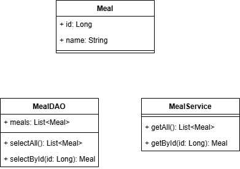

# TP : Gestion des Recettes avec Ingrédients

## Objectifs du TP

Dans ce TP, vous allez apprendre à :
- Créer une application structurée en couches **BO**, **DAO**, **Service** et **IHM**.
- Manipuler des concepts de base tels que les entités, les relations, et la gestion de la persistance des données.
- Appliquer ces concepts pour gérer des recettes (`Meal`) avec leurs ingrédients (`Ingredient`).

## Instructions

### 1. Définir les Entités

- Créez deux classes principales dans la couche BO (**Business Object**) :
  - **Meal** : représente un repas. Les attributs incluront :
    - `id` : Identifiant unique.
    - `name` : Nom du repas.
    - `ingredients` : Liste des ingrédients associés.
  - **Ingredient** : représente un ingrédient. Les attributs incluront :
    - `id` : Identifiant unique.
    - `name` : Nom de l'ingrédient.
    - `quantity` : Quantité de l'ingrédient utilisée dans un repas.

### 2. Couche DAO (**Data Access Object**)

- Implémentez une classe `MealDAO` qui aura les responsabilités suivantes :
  - Stocker une liste de repas en mémoire.
  - Ajouter un nouveau repas.
  - Récupérer un repas par son identifiant.
  - Supprimer un repas.

### 3. Couche Service

- Implémentez une classe `MealService` qui utilisera `MealDAO` pour gérer la logique métier. Les fonctionnalités incluront :
  - Ajouter un nouveau repas avec des ingrédients.
  - Lister tous les repas.
  - Récupérer les détails d'un repas spécifique.
  - Supprimer un repas par son identifiant.

### 4. Interface Utilisateur (IHM)

- Développez une simple interface utilisateur textuelle ou graphique permettant à l'utilisateur de :
  - Ajouter un repas avec des ingrédients.
  - Voir la liste des repas disponibles.
  - Afficher les détails d'un repas spécifique.
  - Supprimer un repas.

### 5. Consignes supplémentaires

- **Structure** : Respectez la séparation des couches pour une meilleure lisibilité et maintenabilité.
- **Documentation** : Ajoutez des commentaires clairs pour expliquer le fonctionnement de chaque classe et méthode.

### 6. Critères de Validation

- Les entités sont correctement définies et respectent les relations entre `Meal` et `Ingredient`.
- La persistance des données est gérée via la couche DAO.
- La logique métier est centralisée dans la couche Service.
- L'utilisateur peut interagir avec le programme via l'IHM pour accomplir toutes les actions requises.

## Partie 1 

Dans un premier temps, commencez par implémenter les deux fonctionnalités principales : `getAll` et `getById`.

1. Débutez avec la couche **BO** et **DAO**.
2. Continuez avec la couche **Service**.
3. Terminez par l'implémentation de l'IHM, que ce soit en console ou avec une interface graphique.

### Schema UML (version 1)

---