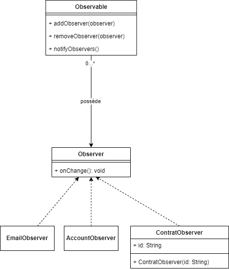

# TP - Pattern Observable (Niveau 1)

## Objectif

Créer une classe **Observable** qui pourra contenir des **Observers** et notifier ces derniers en cas de changement.

### Détails

- La classe **Observable** doit contenir une liste d'**Observers**.
- Les **Observers** seront définis à l'aide d'une **interface**.
- Voici les fonctionnalités attendues :
  - Ajouter ou supprimer des **Observers** dans un **Observable**.
  - Une méthode **onChange** dans les **Observers** sera utilisée pour notifier les changements.

---

### Étapes

1. Créez une **interface** `Observer` avec une méthode `onChange` qui sera appelée lors d'une notification.
2. Créez une **classe** `Observable` qui permet d'ajouter, de supprimer et de notifier des `Observers`.
3. Créez et complétez les autres classes présentes dans le fichier `App.js` (le main).


### Rappel Pattern


### Schema UML



### Main

Voici le main déjà développé, débrouillez-vous pour qu'il fonctionne et que les prints s'affichent bien dans la console.

:::warning Attention 

VOUS NE DEVEZ PAS TOUCHER AU CONTENU DU CODE DANS LE MAIN

:::

Le package sera nommé : `fr.eni.tp`

```java
package fr.eni.tp;

public class App {

	public static void main(String[] args) {
		 // Création de l'observable
        Observable observable = new Observable();

        // Création des observateurs
        Observer observer1 = new EmailObserver();
        Observer observer2 = new ContratObserver("148451841517");
        Observer observer3 = new AccountObserver();

        // Ajout des observateurs
        observable.addObserver(observer1);
        observable.addObserver(observer2);
        observable.addObserver(observer3);

        // Modification le nombre
        System.out.println("Premier appel des observers dans l'observable...");
        observable.notifyObservers();
        
        // Suppression d'un observateur
        System.out.println("\nSuppression d'un observateur...");
        observable.removeObserver(observer2);
        observable.notifyObservers();
    }
}
```

### Exemple de Résultat Attendu

Voici ce qui doit être affiché dans la console:

```
Premier appel des observers dans l'observable...
L'email change ! Mais pour le moment on ne connait pas l'email
Le compte numéro : 148451841517 a changé !
L'état du compte a changé ! Mais aucune info pour le moment

Suppression d'un observateur...
L'email change ! Mais pour le moment on ne connait pas l'email
L'état du compte a changé ! Mais aucune info pour le moment
```