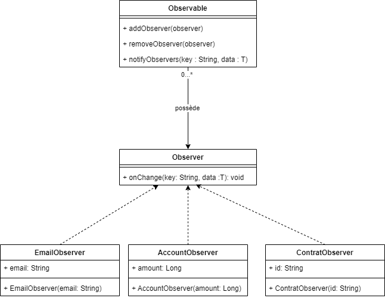

# TP - Pattern Observable (Niveau 2)

## Objectif

Étendre votre implémentation actuelle en ajoutant de la **généricité** dans le pattern Observable. Cela permettra à la méthode `onChange` d'accepter des données spécifiques à chaque type d'observateur, rendant le système plus flexible et réutilisable.

---

## Modifications attendues

1. La méthode `onChange` dans l'interface `Observer` doit être générique pour accepter une donnée de type personnalisable.
2. L'implémentation des classes concrètes `Observer` doit être adaptée pour prendre en charge cette donnée.
3. En gros la méthode onChange aura deux paramètres : 
    - la clé en String
    - la donnée générique

### Schema UML



---

## Étapes

- Modifier l'interface `Observer`
- Modifier la classe `Observable`
- Adapter les classes qui implémentent `Observer`

## OnChange

- **EmailObserver** : L'email se met à jour si c'est la clé `email` avec une donnée générique **String** qui est appelée

- **AccountObserver** : Le montant se met à jour si c'est la clé `amount` avec une donnée générique **Long** qui est appelée


### Main

Voici le main déjà développé, débrouillez-vous pour qu'il fonctionne et que les prints s'affichent bien dans la console.

:::warning Attention 

VOUS NE DEVEZ PAS TOUCHER AU CONTENU DU CODE DANS LE MAIN

:::

Le package sera nommé : `fr.eni.tp`

```java
public class App {

	public static void main(String[] args) {
		 // Création de l'observable
        Observable observable = new Observable();

        // Création des observateurs
        Observer observer1 = new EmailObserver();
        Observer observer2 = new ContratObserver("148451841517");
        Observer observer3 = new AccountObserver();

        // Ajout des observateurs
        observable.addObserver(observer1);
        observable.addObserver(observer2);
        observable.addObserver(observer3);

        // Notifier un mail
        System.out.println("Appel avec un email envoyé");
        observable.notifyObservers("email", "titi@gmail.com");
        
        // Notifier un montant
        System.out.println("Appel avec un montant envoyé");
        observable.notifyObservers("amount", 256L);
    }
}
```

### Exemple de Résultat Attendu

Voici ce qui doit être affiché dans la console:

```
Appel avec un email envoyé
L'email change  : titi@gmail.com
Appel avec un montant envoyé
L'état du compte a changé : 256
```