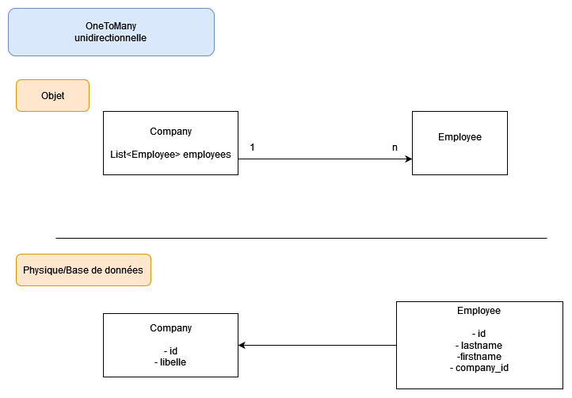

# Les associations

Elles permettent de manipuler les objets à l'aide des jointures.

Il existe plusieurs type d'associations

Une **association** se définit par :
- Sa cardinalité
- Sa direction (unidirectionnelle ou bidirectionnelle)

Il existe **4 cardinalités** : 
- OneToOne
- OneToMany
- ManyToOne
- ManyToMany

## One To One

La relation **OneToOne** peut se traduire par :

> Un Objet A posséde un Objet B
> 
> Un Objet B est possédé par un Objet A

Cela pourrait être réprésenté sous la forme de ce schéma


### Classe Person

```java
@Entity
public class Person {

	@Id
	@GeneratedValue(strategy = GenerationType.IDENTITY)
	public int id;
	
	public String firstname;
	public String lastname;

	@OneToOne(cascade = CascadeType.ALL)
	@Basic(fetch = FetchType.LAZY)
	public Address adresse;
	

	public Address getAdresse() {
		return adresse;
	}

	public void setAdresse(Address adresse) {
		this.adresse = adresse;
	}
}
```

### Classe Address

```java
@Entity
public class Address {

	@Id
	@GeneratedValue(strategy = GenerationType.IDENTITY)
	public int id;
	
	public String libelle;

	/** C'est dans le cas d'une relation bidirectionnelle */
	@OneToOne(mappedBy="address", cascade = CascadeType.ALL)
	public Person person;
}
```

## One To Many

La relation **OneToMany** peut se traduire par :

> Un Objet A posséde **plusieurs** Objet B
> 
> **Des** Objet B sont possédés par un Objet A

Cela pourrait être réprésenté sous la forme de ce schéma



### Classe Company

```java
@Entity
public class Company {

	@Id
	@GeneratedValue(strategy = GenerationType.IDENTITY)
	public int id;
	
	public String name;
	
	@OneToMany(cascade = CascadeType.ALL, fetch = FetchType.LAZY, orphanRemoval = true)
	@JoinColumn(name="Company_id")
	public List<Employee> employees;
	
}
```

### Classe Employee

```java
@Entity
public class Employee {

	@Id
	@GeneratedValue(strategy = GenerationType.IDENTITY)
	public int id;
	
	public String lastname;
	public String firstname;
	
	/**
	 * Constructeur vide par défaut
	 */
	public Employee() {
	}
	
	/**
	 * Constructeur avec nom et prénom (attention pas d'id)
	 * @param lastname
	 * @param firstname
	 */
	public Employee(String lastname, String firstname) {
		super();
		this.lastname = lastname;
		this.firstname = firstname;
	}
}
```