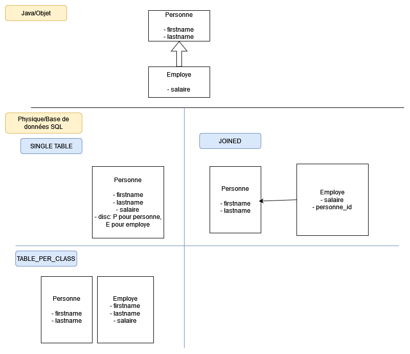

# Les héritages

L'objectif est de répondre à cette question :

> Comment l'héritage objet est traduit dans le base de données (spécialement avbec JPA)

Il existe plusieurs réponses.

Généralement nous avons **3 manières** de transcrire un modèle de données objet physiquement :

- **SINGLE_TABLE** : Tout les objets ayant le même héritage seront stockés dans **la même table**. Un discriminant sera utilisé pour identifier le **type** de l'**objet**
- **JOINED** : Chaque objet est traduite par une table et l'héritage se fait via les jointures
- **TABLE_PER_CLASS** : Chaque objet est traduit par une table **mais sans jointure**, par conséquence on duplique les valeurs en communes dans chaque table

Un exemple de représentation de ces 3 stratégies via un schéma, dans le cas ou on aurait **Personne** et **Employe** qui hérite de **Personne** 

