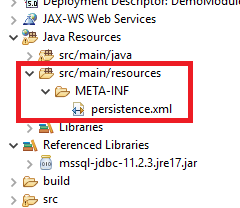
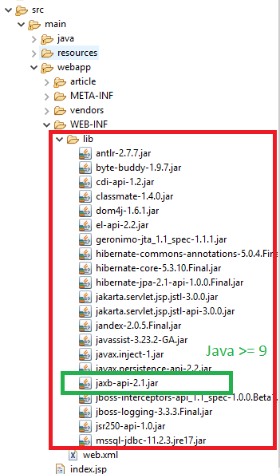
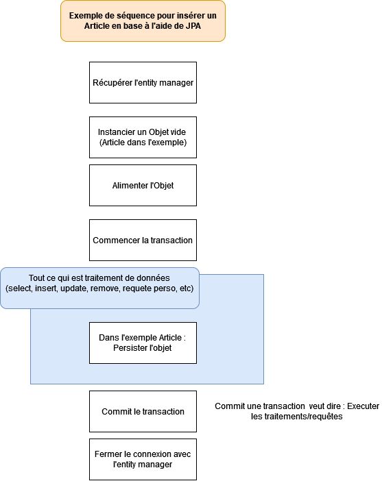

# Les bases

Globalement pour utiliser JPA dans un projet **from scratch** vous allez devoir respectez quelques conditions.

## Fichier persistence.xml

Afin de configurer JPA et le driver necessaire pour se connecter à la base de données SQL nous devons créer un fichier **persistence.xml** dans les ressources Java

<u>Exemple de la location du fichier :</u>



<u>Exemple du code xml </u>

```xml
<?xml version="1.0"  encoding="UTF-8"?>
<persistence xmlns="http://java.sun.com/xml/ns/persistence"
	xmlns:xsi="http://www.w3.org/2001/XMLSchema-instance" version="2.0"
	xsi:schemaLocation="http://java.sun.com/xml/ns/persistence
              http://java.sun.com/xml/ns/persistence/persistence_2_0.xsd">
	
	<persistence-unit name="myPersistence" transaction-type="RESOURCE_LOCAL">
	
		<class>fr.eni.bo.Article</class>
		
		<properties>
		    <property name="javax.persistence.transactionType" value="RESOURCE_LOCAL"/>
			<property name="javax.persistence.jdbc.driver" value="com.microsoft.sqlserver.jdbc.SQLServerDriver"/>
			<property name="javax.persistence.jdbc.url" value="jdbc:sqlserver://localhost:1433;databaseName=DB_Demo;trustServerCertificate=true"/>
			<property name="javax.persistence.jdbc.user" value="sa"/>
			<property name="javax.persistence.jdbc.password" value="Pa$$w0rd"/>
			
			<property name="hibernate.show_sql" value="true"/>
			<property name="hibernate.format_sql" value="true"/>
			<property name="hibernate.hbm2ddl.auto" value="create"/>
			
		</properties>
	</persistence-unit>
	
</persistence>
```

## Importer les librairies

Vous allez devoir importer les **lib Java** nécessaires pour utiliser JPA et son **implementation Hibernate**

Sur Java 21 il faut aussi importer la lib **jaxb-api-2.1.jar** pour la lecture du fichier XML **persistences.xml**



## Utilisation de JPA

Afin d'utiliser JPA nous allons généralement avoir besoin de :
- Récupérer l'**EntityManager**
- Faire du traitement
- Fermer la connexion avec l'**EntityManager**

Evidement selon le contexte dans **le traitement** on va avoir besoin d'adapter le code selon le besoin.

Par exemple dans le cadre d'un insert on peut **instancier un objet vide** et utiliser **les transactions**.




Dans le code ca peut revenir à faire cela : 

```java
EntityManagerFactory emf = Persistence.createEntityManagerFactory("myPersistence");
EntityManager em = emf.createEntityManager();

// Creer un article
Article article = new Article();
article.title = "Le cours va trop vite aled";

// Start transaction
em.getTransaction().begin();

// Je persiste (envoyer) l'article en base
em.persist(article);

// Commit la transaction
em.getTransaction().commit();

// Fermer les instances/connexions JPA
emf.close();
em.close();
```

:::danger Rappel important

Attention vous devez avoir un **constructeur vide** d'existant dans vos classes lorsque vous utilisez la sérialisation

:::