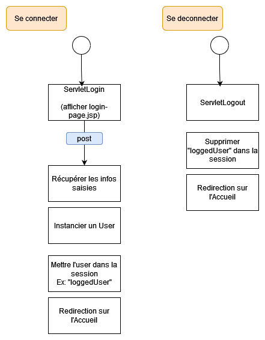

# TP 06 - Page de connexion

Suite TP Suivis Repas

> **Note:** Avant de démarrer ce TP, il convient d’avoir suivi les vidéos des modules 1 à 6 et d’avoir réalisé les TP proposés.

**Durée Estimée : 1h**

## Enonce

En vous basant sur la Demo du module 6, vous allez ajouter une page de connexion dans le TP-SuivisDesRepas (fil rouge)

- Page **login-page.jsp** à creer
- Avoir une classe **User** avec l'**email** et le **pseudo**
- **ServletLogin** à créer
- **ServletLogout** à créer

### Schema processus

### Sur la page d'Accueil

<u>Si vous êtes connecté :</u>  afficher le texte "Vous êtes connecté(e) [le pseudo de l'user]" et le bouton/lien pour se deconnecter

<u>Sinon :</u>  afficher le texte "Vous êtes déconnecté(e)" et le bouton/lien pour allez sur la page de connexion

:::info Note

Pour les liens "Se connecter" et "Se deconnecter" vous utiliserez la balise **a** mais avec la classe de **uikit** (uk-button uk-button-default) pour 
donner aux liens l'appareance d'un boutton 

Lien de la doc [Documentation UIKit Button](https://getuikit.com/docs/button)
:::

### Astuces

Pour **login-page.jsp** vous pouvez copier coller **page_meal_from.jsp**

Ensuite adapter pour un formulaire de connexion

:::warning Attention

La propriété **action** dans la balise **form** doit être adaptée en conséquence aussi ! (doit cibler l'url de la servlet login)

:::

### A ne pas oublier

Pour les champs, noubliez pas la propriété **name**
