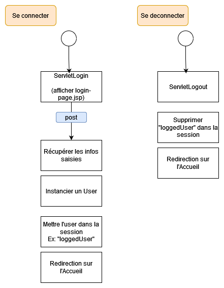

# TP 06 - Page de connexion

Suite TP Suivis Repas

> **Note:** Avant de démarrer ce TP, il convient d’avoir suivi les vidéos des modules 1 à 6 et d’avoir réalisé les TP proposés.

**Durée Estimée : 1h**

## Enonce

En vous basant sur la Demo du module 6, vous allez ajouter une page de connexion dans le TP-Suivis-Repas (fil rouge)

- Page **login-page.jsp** à creer
- Avoir une classe **User** avec l'**email** et le **pseudo**
- **ServletLogin** à créer
- **ServletLogout** à créer

### Schema processus

### Astuces

Pour **login-page.jsp** vous pouvez copier coller **page_meal_from.jsp**

Ensuite adapter pour un formulaire de connexion

### A ne pas oublier

Pour les champs, noubliez pas la propriété **name**
