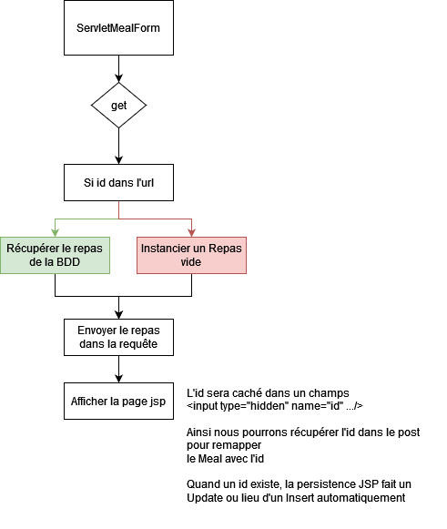
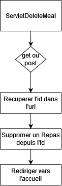
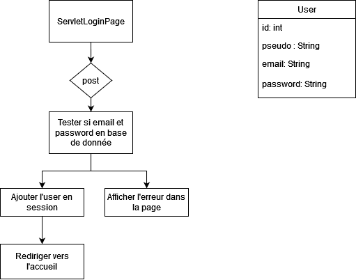
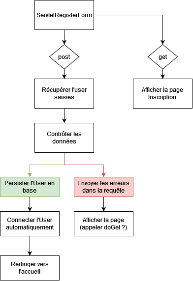
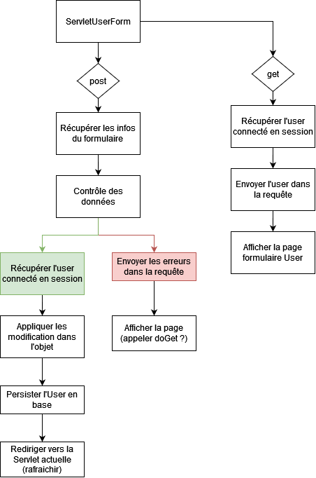

# TP Bonus

Suite TP Suivis Repas

> **Note:** Avant de démarrer ce TP, il convient d’avoir suivi les vidéos des modules 1 à 10 et d’avoir réalisé les TP proposés.

**Durée Estimée : 4H**

## Enonce

Vous allez compléter le TP au maximum pour avoir plus de **features** 

Les features :
- Modification d'un repas
- Supprimer un repas
- Vrai connexion (avec la base de données)
- Inscription
- Modifier profil utilisateur

### Feature : Modification d'un Repas

Ajouter un lien/bouton dans la liste des repas pour rediriger vers la page de modification d'un Repas.

En soit cette page n'est ni plus ni moins que la page qui permet d'ajouter un Repas mais avec l'id 
dans un input caché et l'id dans l'url pour récupérer le repas depuis la BDD.

Il y'aura donc une condition pour savoir si on est en mode **Ajout** ou **Modification**

:::info Note

En gros un objet avec un **id non null** persisté effectue un **update** au lieu d'un **insert** via JPA.

:::



### Feature : Suppression d'un Repas

En JPA, il faut envoyer l'objet dans la méthode **remove** de l'**EntityMananger**
Donc récupérer l'objet Repas via l'id avant. 



### Feature : Connexion (un plus avancée)

Il faut récupérer une utilisateur via une requête avec plusieurs conditions.

```java
// les attributs a tester
String monAttribut = "Test";
String monAutreAttribut = "Un autre Test";

// la construction de la requête
CriteriaBuilder criteriaBuilder = entityManager.getCriteriaBuilder();
CriteriaQuery<Objet> criteriaQuery = criteriaBuilder.createQuery(Objet.class);
Root<Objet> root = criteriaQuery.from(Objet.class);

Predicate condition = criteriaBuilder.and(
    criteriaBuilder.equal(root.get("monAttribut"), nomRecherche),
    criteriaBuilder.equal(root.get("monAutreAttribut"), monAutreAttribut)
);

criteriaQuery.select(root).where(condition);

TypedQuery<Objet> query = entityManager.createQuery(criteriaQuery);
// récupérer le result
Objet resultat = query.getSingleResult();
```

:::info Note

Bien sûr vous devez remplacer le type **Objet** par votre objet (exemple : **User**) 

Et adapter le code selon votre besoin

:::



### Feature : Inscription



### Feature : Modifier profil utilisateur



