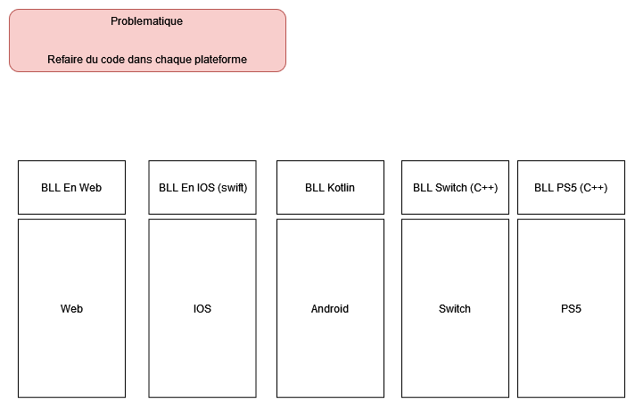
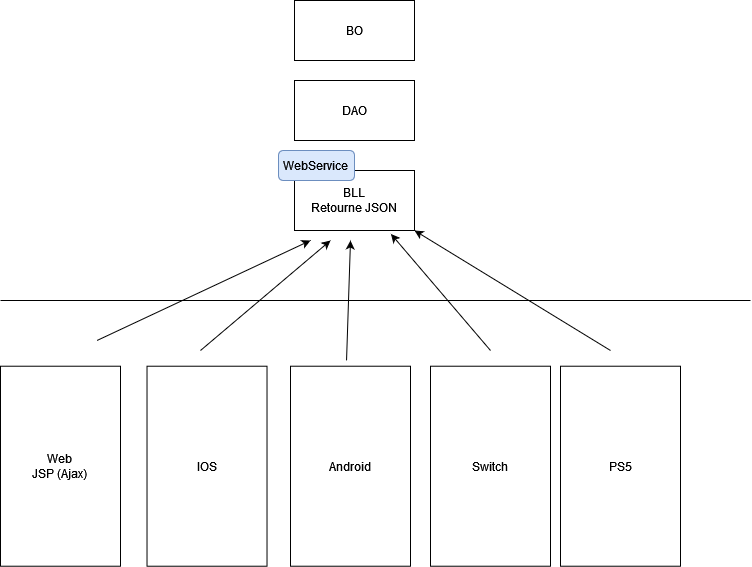
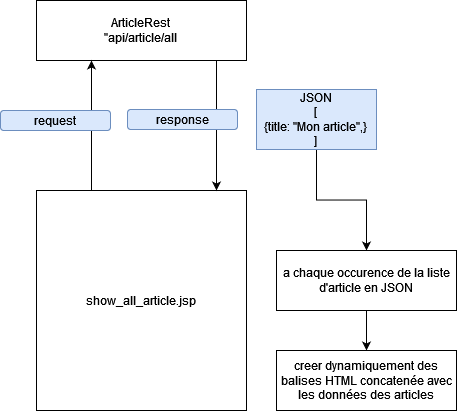

# Synthese

L'objectif est de répondre à cette question :

## Problématique

Sans API donc aucun moyen de communiquer entre plusieurs plateformes, on est assez limité en ce qui concerne la **centralisation** du code métier.



## Solution proposée

Une solution assez commune est justement la mise en place d'un **Web Service** afin de pouvoir permettre une communication entre diverses plateformes.

Globalement un **WebService ReST** va permettre cette communication à l'aide d'un format de données, aujourd'hui trés souvent en format JSON.



## JSON

Le JSON est un format de données **universel** trés **simplifié** avec une lecture assez accessible.

<u>Exemple de JSON:</u>

```json
{
    "title" : "Le titre d'un article",
    "description" : "La description d'un article",
    "date" : "26/08/2023"
}
```

## Communiquer avec JS en WEB




Le script js qui pourrais récupéer une liste d'articles :

```js
async function logArticles(){
	
	// Afficher une popup
	// TODO
	
	// Appeler l'url d'une api et récupérer sa réponse
	const response = await fetch("http://localhost:8080/DemoModule10/api/article/all" , { method: "GET"});

	// Transformer la réponse en JSON (donc en JS c'est un objet JS)
	const articles = await response.json();

	// Cacher la popup
	// TODO
	
	// Afficher les données dans la console web
	console.log(articles);
	
	// Récupérer le parent Div
	const parentDiv = document.getElementById("container");
	
	// Pour chaque article
	for (const index in articles){
		
		const article = articles[index];
		
		// Créer une div à la volé
		const divArticle = document.createElement("div");
		
		// Mettre dans cette div à la volé le titre de l'article
		divArticle.textContent = article.title;
		
		// Ajouter la boit div Article à l'intérieur de parentDiv
		parentDiv.appendChild(divArticle);
	}
}

logArticles();
```