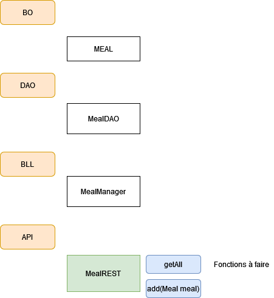

# TP 10 - Web Service

Suite TP Suivis Repas

> **Note:** Avant de démarrer ce TP, il convient d’avoir suivi les vidéos des modules 1 à 10 et d’avoir réalisé les TP proposés.

**Durée Estimée : 1h**

## Enonce

En vous basant sur la Demo du module 10, vous allez ajouter **la partie web service** dans le TP-SuivisDesRepas (fil rouge)

N'oubliez pas les points suivants :

- Importer les libs java nécessaires
- Avoir le ConfigurationREST pour l'api
- Tout le code en lien avec l'apli à mettre dans un package **api** pour ranger le code (exemple: fr.eni.api)

Le **web service** aura deux points d'entrée à savoir:
- getAll : retourne en json tout les repas
- add : ajouter un repas et retourne en json **true**

