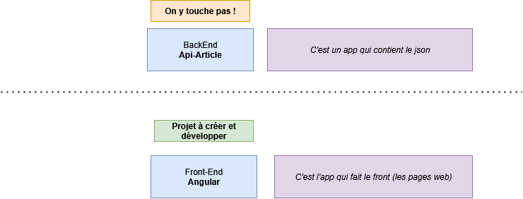

# Project Angular 20 - Gestion d’Articles

**Durée estimée : 2 jours**  
**Niveau : Intermédiaire à Avancé**  
**Technologies : Angular 20, TypeScript, RxJS, API REST**

## Objectif du projet

Développer une application **Angular 20** complète permettant la gestion d’un catalogue d’articles.  
L’application devra communiquer avec une **API REST locale** disponible à l’adresse suivante :  
[https://github.com/Chocolaterie/ApiArticle](https://github.com/Chocolaterie/ApiArticle)

L’objectif est de mettre en œuvre les concepts fondamentaux d’Angular : composants, routing, formulaires réactifs, services, communication HTTP et gestion d’état.

## Information

Vous n'avez pas besoin de toucher au Back-End **ApiArticle**, c'est une application qu'on lance via le terminal
pour avoir accès aux ressources JSON.

Votre rôle est de développer uniquement le **Front-End** (donc uniquement la partie **Angular**).

Pour rappel concernant un projet Angular :
- On ne le crée jamais à la main, mais via la ligne de commande `ng new mon-projet-angular`
- Les fichiers comme les services, pages ou composants ne sont jamais créés à la main, mais avec les lignes de commande `ng generate quelquechose mon-quelquechose` (à voir dans les slides, sur Internet, dans la documentation ou avec ChatGPT)

### Quelques rappels

#### Creer un projet

`ng new mon projet`

#### Creer une page

`ng generate component pages/ma-page`

#### Creer un service

`ng generate service services/mon-service`

## Spécifications fonctionnelles

L’application devra comporter les fonctionnalités suivantes :

### Authentification
- Page de **connexion**
- Page d’**inscription**
- Page de **mot de passe oublié**

### Gestion des articles
- **Liste des articles** : affichage des articles provenant de l’API
- **Détail d’un article** : consultation des informations d’un article spécifique
- **Ajout et modification d’un article** : formulaire pour créer ou éditer un article
- **Suppression d’un article**

Chaque fonctionnalité devra être accessible via le **système de routing Angular**, avec une navigation claire et un contrôle d’accès (auth guard).

#### Proposition ordre (par difficulté) :

- **Liste des articles**
- **Détail d’un article** : url avec /:id
- **Suppression d’un article**
- Page de **connexion**
- Page **Ajout et modification d’un article**
- Page de **connexion**
- Page d’**inscription**
- Page de **mot de passe oublié**
- Les autres pages

#### Détail d'un Article

Scénario :
- Tu cliques sur un article
- Pour naviguer dans la page détail de l'article (utiliser [routerLink])

#### Suppression d’un article

Scénario:
- Quand tu cliques sur le bouton supprimer
- Appeler le service pour Delete (pas de page liée à la suppréssion)
- Aprés appel service, deux choix :
  - Refresh la page (comme un F5)
  - Supprimer en temps réel l'article dans la liste (Plus compliqué)

## Arborescence

### Par type de fichier

- src/app/
  - pages/
    - Toutes les pages
  - services/
    - Tous les services
    
### Par module

- src/app/
  - article/
    - pages/
    - services/
  - auth/
    - pages/
    - services/

## Exigences techniques

- Version Angular : **v20**
- Langage : **TypeScript**
- Gestion des appels HTTP via le module `HttpClient`
- Utilisation des **Formulaires Réactifs**
- Gestion des routes et sous-modules avec **RouterModule**
- Utilisation des **services Angular** pour la communication avec l’API

## Critères d’évaluation

- Respect des bonnes pratiques Angular (modularité, typage, réactivité)
- Organisation et clarté du code
- Qualité du design et de l’expérience utilisateur
- Gestion correcte des erreurs et retours API
- Navigation fluide et cohérente entre les différentes pages

## Ressources

- API Back-end : [https://github.com/Chocolaterie/ApiArticle](https://github.com/Chocolaterie/ApiArticle)
- Documentation officielle Angular : [https://angular.dev](https://angular.dev)

## Livrables

- Projet Angular complet sur un dépôt Git public (GitHub ou GitLab)
- Documentation minimale dans un fichier `README.md` :
  - Instructions d’installation et de lancement
  - Présentation rapide des fonctionnalités