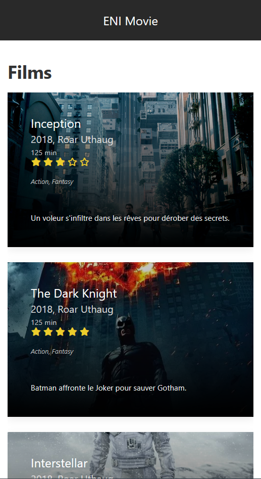

# TP Angular (Partie 1)

**Durée estimée : 2h**

## Énoncé

Vous devez créer une page Angular pour afficher la liste de films.

- Créez un composant `movie-list`.
- Pour le moment, simulez une liste de 3 films dans le contrôleur TypeScript afin d’afficher un aperçu dans le HTML.
- Liez ce composant à une URL comme `/movies`.
- Une proposition de la liste des films dans le contrôleur.

```ts
movies = [
  {
    id: 1,
    slug: "1",
    title: "Inception",
    year: 2018,
    author: "Roar Uthaug",
    duration: 125,
    genre: "Action, Fantasy",
    synopsis: "Un voleur s'infiltre dans les rêves pour dérober des secrets.",
    cover: "https://m.media-amazon.com/images/M/MV5BMjAxMzY3NjcxNF5BMl5BanBnXkFtZTcwNTI5OTM0Mw@@._V1_.jpg",
    rating: 3
  },
  {
    id: 2,
    slug: "2",
    title: "The Dark Knight",
    year: 2018,
    author: "Roar Uthaug",
    duration: 125,
    genre: "Action, Fantasy",
    synopsis: "Batman affronte le Joker pour sauver Gotham.",
    cover: "https://image.tmdb.org/t/p/w500/qJ2tW6WMUDux911r6m7haRef0WH.jpg",
    rating: 5
  },
  {
    id: 3,
    slug: "3",
    title: "Interstellar",
    year: 2018,
    author: "Roar Uthaug",
    duration: 125,
    genre: "Action, Fantasy",
    synopsis: "Une équipe voyage à travers un trou de ver pour sauver l'humanité.",
    cover: "https://m.media-amazon.com/images/M/MV5BYzdjMDAxZGItMjI2My00ODA1LTlkNzItOWFjMDU5ZDJlYWY3XkEyXkFqcGc@._V1_FMjpg_UX1000_.jpg",
    rating: 4
  }
];
```    

## Design d’un film

- Pour commencer sans CSS, utilisez un `<li>`.
- Ensuite, améliorez le style avec du SCSS et des composants de type **card**.
- Si vous avez encore du temps :
  - Affichez la **note** sous forme d’étoiles.
  - Intégrez l’**image de couverture** du film.



## Template de page

Si vous ne souhaitez pas vous embêter à créer votre propre `app.component.html`, vous pouvez récupérer le mien.

```html
<!DOCTYPE html>
<html lang="en">
<head>
  <meta charset="utf-8">
  <meta name="viewport" content="width=device-width, initial-scale=1">
  <title>Price - UIkit 3 KickOff</title>
  <link rel="icon" href="img/favicon.ico">
  <style>
    .uk-container-small {
      max-width: 1020px;
    }
  </style>
</head>
<body>

<!--HEADER-->
<header class="uk-box-shadow-small uk-section-secondary eni-header">
  <div class="uk-container uk-container-expand">
    <nav class="uk-navbar" id="navbar" data-uk-navbar>
      <div class="uk-navbar-center">
        <a class="uk-navbar-item uk-logo" href="#">ENI Movie</a>
      </div>
    </nav>
  </div>
</header>
<!--/HEADER-->

<router-outlet />

<!--FOOTER-->
<footer class="uk-section-secondary">
  <div class="uk-container uk-section">
    <div class="uk-grid uk-child-width-1-3@l" data-uk-grid>
      <div>
        <h4>Social Media</h4>
        <a href="" class="uk-icon-button  uk-margin-small-right" data-uk-icon="facebook"></a>
        <a href="" class="uk-icon-button  uk-margin-small-right" data-uk-icon="twitter"></a>
        <a href="" class="uk-icon-button" data-uk-icon="instagram"></a>
      </div>
    </div>
  </div>
  <div class="uk-section uk-section-xsmall" style="background-color: rgba(0,0,0,0.15)">
    <div class="uk-container">
      <div class="uk-grid uk-child-width-1-2@s uk-text-center uk-text-left@s" data-uk-grid>
        <div class="uk-text-small uk-text-muted">
          Copyright 2025 - All rights reserved.
        </div>
      </div>
    </div>
  </div>
</footer>
<!--/FOOTER-->

</body>
</html>
```