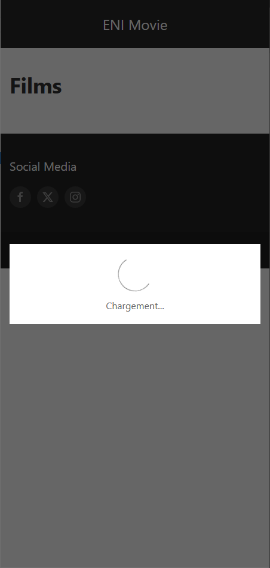

# TP Angular (Partie 3)

**Durée estimée : 30min**

## Énoncé

Pour améliorer l’UX, nous allons ajouter une **modal de chargement** lors de l’affichage des films.

Nous allons donc :

- Ajouter une modal de chargement globale dans l’application (dans le HTML).
- Dans le contrôleur TypeScript de `movie-list` :
    - Afficher la modal **avant l’appel** au service.
    - Fermer la modal **à la fin de l’appel**, à la fois dans `next` et `error`.
- Ajouter un **faux délai d’1 seconde** dans la méthode `getMovies` du `MovieService`, pour laisser le temps de voir la modal.

### UIKit

Nous allons utiliser les **modals de UIKit**.

Dans le fichier TypeScript, tout en haut, ajoutez :

```ts
declare const UIkit: any;
```

Cela permet à TypeScript de reconnaître les fonctionnalités JavaScript de UIKit (comme `show()` / `hide()`).

Exemple d'utilisation :

```ts
UIkit.modal('#loading-modal').show();
UIkit.modal('#loading-modal').hide();
```

### Exemple

