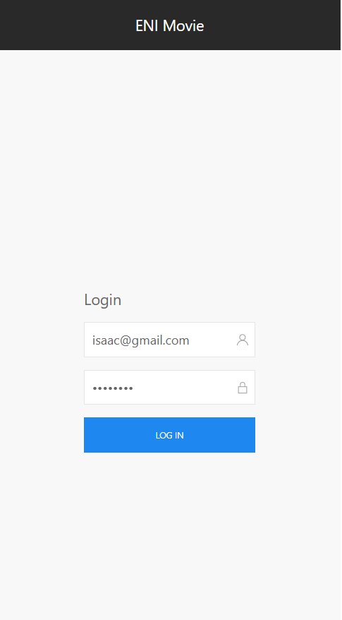

# TP Angular (Partie 4)

**Durée estimée : 30min - 1h**
## Énoncé

Ajouter une page de **connexion (login)**.

Elle doit permettre d’appeler l’API :  
`http://localhost:3000/login`  
avec, dans le **body de la requête** (le payload), les informations nécessaires à la connexion.

Exemple :

```json
{
  "email": "isaac@gmail.com",
  "password": "password"
}
```

Il vous faut donc un service qui envoie une requête **POST**, avec un objet (de type `any` ou typé) contenant `email` et `password`.

### Exemple visuel



### Binding

Pour le formulaire, comme vous êtes sur Angular, vous utiliserez des **`ngModel`** pour lier les champs `email` et `password` à des attributs de votre classe (probablement un objet `user`).

C’est grâce à cet objet **bindé en temps réel** que vous pourrez envoyer les informations de connexion à l’API.

## Écran de chargement

Comme pour la liste des films, affichez une **modal de chargement** pendant l’appel à l’API.

## Message de retour

Comme vous le savez, la réponse JSON contient un **code** et un **message**.

Trouvez un moyen d’afficher dans une **modal** le **message métier** retourné par le JSON, **juste après la fermeture de la modal de chargement**.
