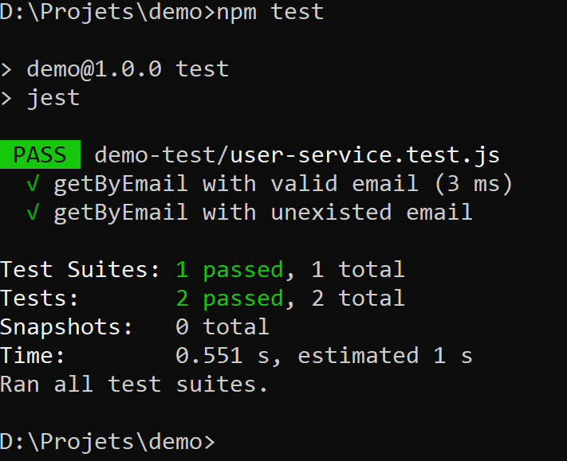

# Test Unitaire/Fonctionnel (Jest)

Démonstration de mise en place d'un test fonctionnel sur un projet JS (Node) avec Jest.

Pour l'installation de Jest, vous pouvez suivre ce lien :
- https://jestjs.io/docs/getting-started

## Spécifier l'outil  de test

Il faut spécifier dans le **package.json** que notre commande **test** utilisera **Jest**, notre librairie de tests unitaires.


```json
...
"scripts": {
    "test": "jest"
},
...
```

Ainsi nous pourrons lancer les test avec la commande ```npm test```

## Creer un fichier de test

Les fichiers de test doivent avoir l'extension `.test.js` pour être reconnus comme un fichier de test.

**Exemple de fichier qui contient deux tests :**

- Un test qui attend qu'un code métier soit égal à `200`.
- Un test qui attend qu'un code métier soit égal à `703`.

```js
const userService = require('./user-service');

test('getByEmail with valid email', () => {
    const serviceResponse = userService.getByEmail("isaac@gmail.com");
    expect(serviceResponse.code).toBe('200');
});


test('getByEmail with unexisted email', () => {
    const serviceResponse = userService.getByEmail("i@gmail.com");
    expect(serviceResponse.code).toBe('703');
});

```

## Lancer le test

Comme dit plus haut, nous pouvons lancer les test avec la commande ```npm test```

Exemple de resultat dans le cmd :

