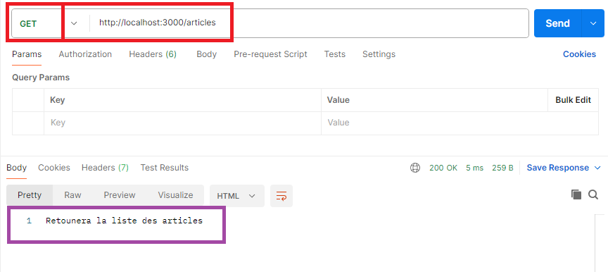
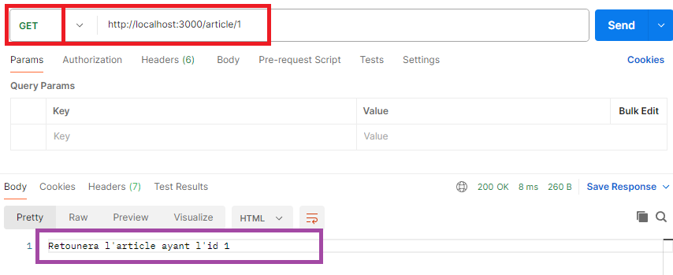
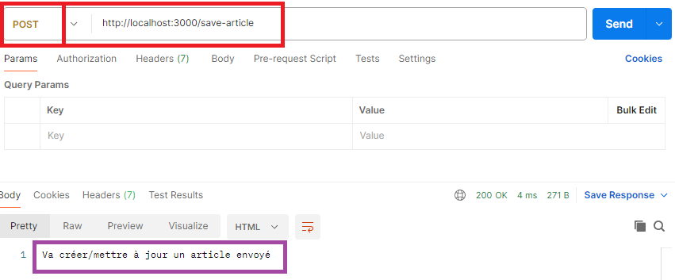
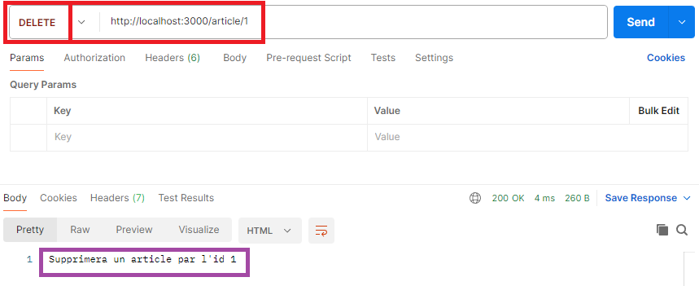

# TP Article API (Partie 1)

> **Note:** Avant de démarrer ce TP, il convient d’avoir suivi les vidéos des modules 1 à 4 et d’avoir réalisé les TP proposés.

**Durée Estimée : 2H**

## Enonce

Dans ce TP, vous allez créer un projet Express contenant les routes nécessaires à la manipulation des articles. 

Dans un premier temps, n'utilisant que Express, vous allez préparer les routes en retournant un message dans chacune d'elles.


### Procédure d'initialisation du projet

Pour vous aider, voici une proposition concernant les étapes pour initialiser votre projet avec un point d'entrée (app.js)

- Créer un dossier **tp_article_api**
- Dans ce dossier **initialiser** le **package.json**
- Ajouter le module **express** dans le projet
- Créer un fichier **app.js**

Nous aurons pour l'instant 4 routes :

- **GET** -> /articles
- **GET** -> /article/:id
- **POST** -> /save-article
- **DELETE** -> /article/:id

Vous trouverez ci-dessous la liste des résultats attendus pour chaque route via **Postman**

:::info Afficher les message

Vous afficherez les messages via l'instruction suivante (et non **console.log**):

```js
res.send(`Mon message`)
res.json({message: `Mon message`})
:::

:::warning Rappel !

Faites bien attention à vérifier minutieusement le code que vous avez écrit pour éviter les fautes de frappe et donc les erreurs d'exécution

Exemple d'erreur fréquent : 

```js
const expres = require('express');
const app = express(); // oublie d'un 's' dans expres
```

:::

#### Liste des Articles

Via Postman vous testerez par exemple l'url (en **GET**) :

`http://localhost:3000/articles` 



#### Un Article

Via Postman vous testerez par exemple l'url (en **GET**) :

`http://localhost:3000/article/1` 



#### Sauvegarder un Article

Via Postman vous testerez par exemple l'url (en **POST**) :

`http://localhost:3000/save-article` 



#### Supprimer un Article

Via Postman vous testerez par exemple l'url (en **DELETE**) :

`http://localhost:3000/article/1` 



### (Bonus) Pour aller plus loin

Si vous avez terminé le TP en avance, vous pouvez essayer de séparer la déclaration des routes dans un fichier externe.

Créez un fichier **routes.js** qui contiendra une fonction attendant l'objet **app** en tant que paramètre. 

Cette fonction sera appelée dans **app.js**