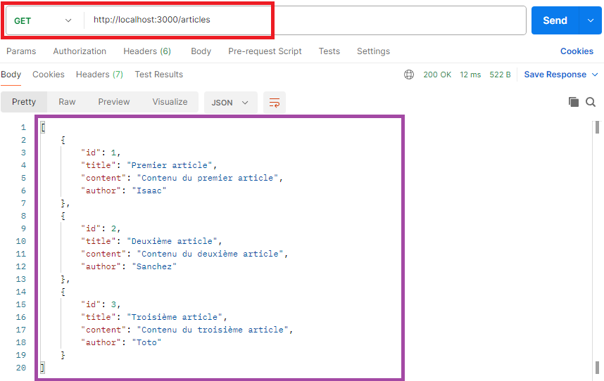
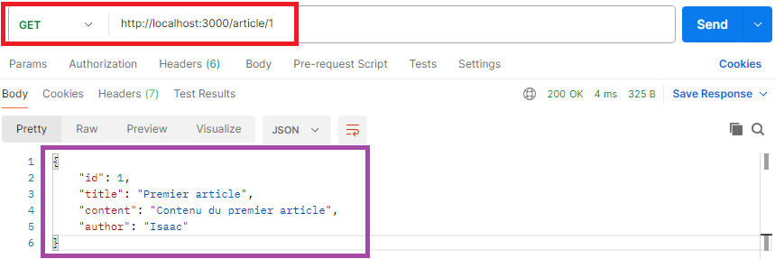
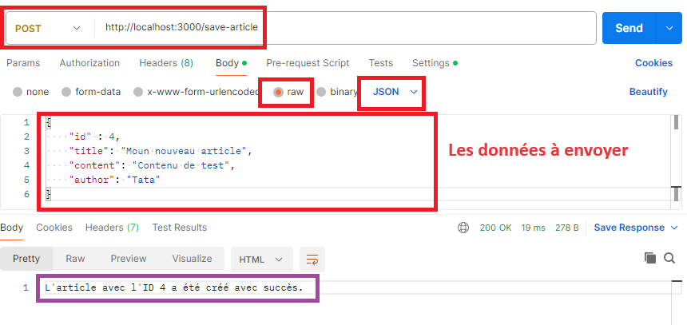
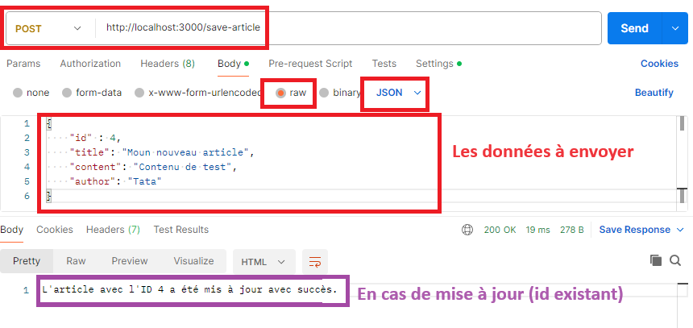
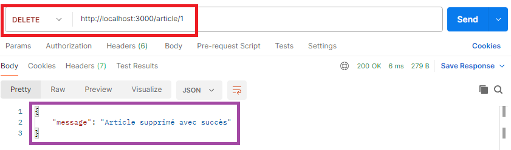
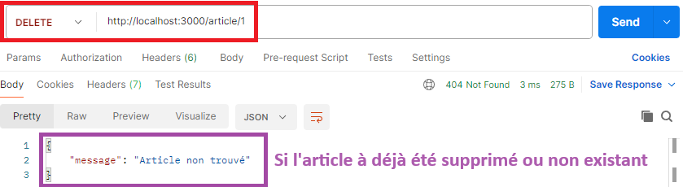

# TP Article API (Partie 2)

> **Note:** Avant de démarrer ce TP, il convient d’avoir suivi les vidéos des modules 1 à 4 et d’avoir réalisé les TP proposés.

**Durée Estimée : 1H**

## Enonce

En partant du TP précédent, l'objectif sera de remplacer les messages de test par des opérations sur des données en mémoire.

Puisque nous n'utilisons pas encore **MongoDB**, nous allons simuler des fausses données.

Exemple d'initialisation de faux articles dans le serveur :

```js
// Simulation de données en mémoire
let articles = [
    { id: 1, title: 'Premier article', content: 'Contenu du premier article', author: 'Isaac' },
    { id: 2, title: 'Deuxième article', content: 'Contenu du deuxième article', author: 'Sanchez' },
    { id: 3, title: 'Troisième article', content: 'Contenu du troisième article', author: 'Toto' }
];
```

A vous d'écrire le code nécessaire pour :

- **/articles :** Retourner la liste des article en JSON

- **/article/:id :** Retourner un article en JSON

- **/save-article :** Ajouter ou mettre à jour l'article envoyer depuis le POST dans la liste des articles.

- **/article/:id :** Supprimer un article de la liste

#### Liste des Articles

Via Postman vous testerez par exemple l'url (en **GET**) :

`http://localhost:3000/articles` 



#### Un Article

Via Postman vous testerez par exemple l'url (en **GET**) :

`http://localhost:3000/article/1` 



#### Sauvegarder un Article

Via Postman vous testerez par exemple l'url (en **POST**) :

`http://localhost:3000/save-article` 



<u>Dans le cas d'une mise à jour :</u>



:::warning Attention !

Dans le cadre d'un **POST** on veut envoyer un article, donc n'oubliez pas de paramétrer correctement l'appel comme affiché ci-dessus

Ne pas oublier le app.use(express.json())

:::


#### Supprimer un Article

Via Postman vous testerez par exemple l'url (en **DELETE**) :

`http://localhost:3000/article/1` 



<u>Si l'id/article n'existe pas</u>

