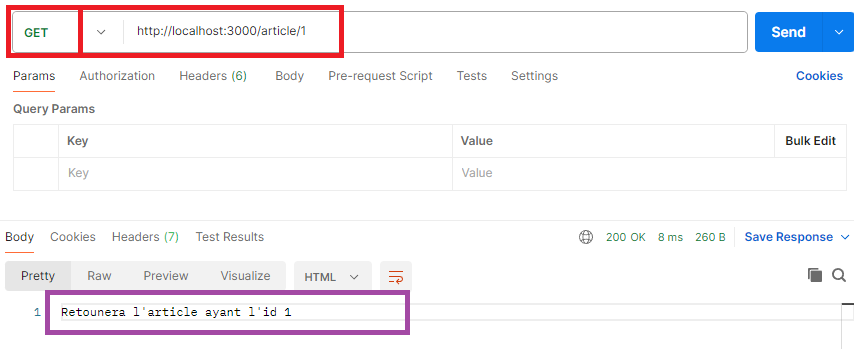

# TP Article API (Partie 1)

**Durée Estimée : 25min**

## Enonce

Dans ce TP, vous allez créer un projet Express contenant les routes nécessaires à la manipulation des articles. 

Dans un premier temps, n'utilisant que Express, vous allez préparer les routes en retournant un message dans chacune d'elles.

### Procédure d'initialisation du projet

Nous aurons pour l'instant 4 routes :

- **GET** -> /articles
- **GET** -> /article/:id
- **POST** -> /save-article
- **DELETE** -> /article/:id

Vous trouverez ci-dessous la liste des résultats attendus pour chaque route via **Postman**

#### Liste des Articles

Via Postman vous testerez par exemple l'url (en **GET**) :

`http://localhost:3000/articles` 

#### Un Article

Via Postman vous testerez par exemple l'url (en **GET**) :

`http://localhost:3000/article/1` 

#### Sauvegarder un Article

Via Postman vous testerez par exemple l'url (en **POST**) :

`http://localhost:3000/save-article` 

#### Supprimer un Article

Via Postman vous testerez par exemple l'url (en **DELETE**) :

`http://localhost:3000/article/1` 

