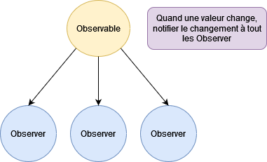

# TP - Pattern Observable

Créer une classe **Observable** générique, car on souhaite que les valeurs à notifier puissent être tout et n'importe quoi, et ne pas se limiter seulement à des **String**, par exemple.


Cette classe va contenir une liste de **Observer**.

Un **Observer** peut être plein de choses : une classe, une interface, une fonction, etc.

Le but est que :
- On peut ajouter ou supprimer des **Observer** dans un **Observable**
- Lorsqu'on change la valeur dans un **Observable**, cela va **notifier** tous les **Observers** que la valeur a changé.



## Proposition

Dans la correction, je ferais des **Observer** en tant que fonctions lambda.

Donc, si vous n'avez pas d'idée sur la définition de votre **Observer**, je vous propose de dire que vos **Observer** seront des fonctions lambda.

## Rappel : Fonction Lambda


Sur Dart, une fonction lambda c'est ce typage : `void Function()`

Exemple de fonction lambda utilisable comme n'importe quelle variable/paramètre :


```dart

// Définir une fonction lambda
void Function() maFonctionLambda = () {
print("Coucou je suis appelé");
};

// Appeler ma fonction lambda
maFonctionLambda();

```

On peut aussi dire que notre typage de fonction lambda attend un ou des paramètres :

```dart

// Définir une fonction lambda avec des paramètres
void Function(String unParam) maFonctionLambda = (unParam) {
print("Coucou je suis appelé et voici unParam : ${unParam}");
};

// Appeler ma fonction lambda avec des paramètres
maFonctionLambda("Chocolatine");

```

On peut faire énormément de choses en POO avec ça. Par exemple, je peux même créer une liste de fonctions dans une variable et les appeler :

```dart
void Function() maFonctionLambda1 = () {
print("Coucou 1");
};

void Function() maFonctionLambda2 = () {
print("Coucou Fonction 2");
};

List<void Function()> mesFonctions = [
maFonctionLambda1,
maFonctionLambda2
];

for (var maFonction in mesFonctions){
maFonction();
 }
```

On pourrait aller plus loin et ajouter des paramètres génériques. Bref, la POO est vaste et permet de faire beaucoup de choses. 

Il faut surtout comprendre que la majorité des éléments sont des classes, de l'héritage, du typage, des signatures, etc. Une fois que l'on connaît ces concepts, peu importe les types ou signatures, même farfelus, il suffit de les appliquer comme tout autre type ou signature.


### Main

Voici le main déjà développé, débrouillez-vous pour qu'il fonctionne et que les prints s'affichent bien dans la console

:::warning Attention 

VOUS NE DEVEZ PAS TOUCHER AU CONTENU DU CODE DANS LE MAIN

:::


```dart
void main() {
  // Créer un observable avec une valeur initiale
  var observable = Observable<int>(0);

  // Ajouter un observateur
  observable.addObserver((value) {
    print('Observateur 1: La valeur a changé: $value');
  });

  // Ajouter un autre observateur
  void Function(int value) observer2 = (value) {
    print('Observateur 2: La valeur a changé: $value');
  };
  observable.addObserver(observer2);

  // Changer la valeur pour voir les observateurs en action
  observable.setValue(1);
  observable.setValue(2);

  // Retirer un observateur
  observable.removeObserver(observer2);

  // Changer la valeur pour voir l'effet après avoir retiré un observateur
  observable.setValue(3);
}
```