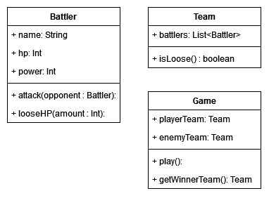

# TP - RPG

Dans une application Java Console (avec le void Main), le but du TP:

Vous allez avoir 3 classes:

## Fonction attack

La fonction **attack** va retirer des **hp**

## Fonction isLoose

Elle permet de savoir si une equipe a perdu, donc si tout les combattant(e)s de l'équipe ont les **hp** à **0**

## Fonction getWinnerTeam

Elle permet de récupérer l'equipe gagnante.

## Objectif

Le but est de instancier deux équipes qui vont se battre. Dans ces **deux equipes** il n'y aura qu'une seule instance de combattant.

Donc deux equipes composées d'un(e) seul(e) combattant(e). 

Dans la fonction **play** de **Game** nous allons mettre la logique du combat.

En gros vous allez boucler **tant qu'une partie n'as pas perdu** pour attaquer les combattants entre eux à l'aide de la méthode **attack**

Lorsqu'on sort de la boucle on affiche le vainqueur.