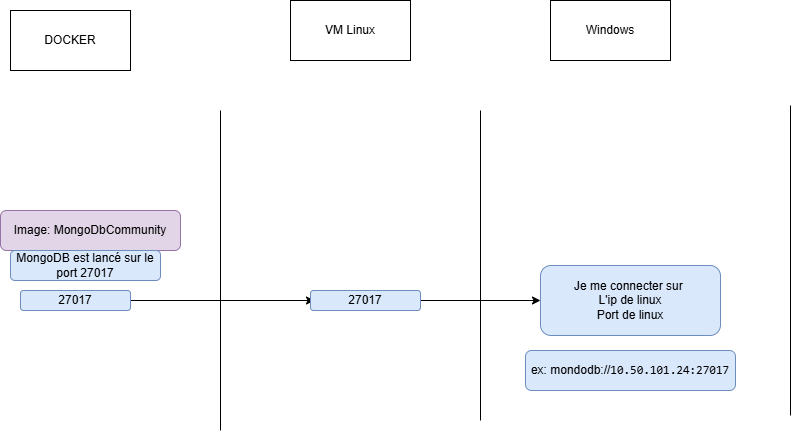

# Utiliser MongoDB sur Docker

## Étapes principales

- Avoir une VM Linux avec Docker installé.
- Puller l'image Docker avec MongoDB Community Server :

```bash
docker pull mongodb/mongodb-community-server:latest
```

- Lancer le Docker sur des ports spécifiques :

```bash
docker run --name mongodb -d -p 27020:27017 mongodb/mongodb-community-server
```

- Détails :
  - **Port forwarding**
    - `27020` : le port de votre machine Linux (mettre un port non utilisé)
    - `27017` : le port du serveur MongoDB dans le Docker

## Tester la connexion de ton MongoDB Docker sur ta machine Windows

- Tu pourras utiliser MongoDB Compass.
- Pour se connecter à une URL Mongo (celle du Docker), tu remarqueras que j'ai mis une IP et le port (ex. `10.50.101.24` qui est l'IP de la machine Linux VM).


## Connecter côté Java

Dans `application.properties`, ne pas oublier de réitérer les paramètres de connexion :

```properties
# Param mongodb (NoSQL)
spring.data.mongodb.host=10.50.101.24
spring.data.mongodb.port=27020
``` 

## Diagramme vulgarisé

### Si il fallait utiliser un autre port (si le port est déjà utilisé)


### Si le port 27017 est libre


