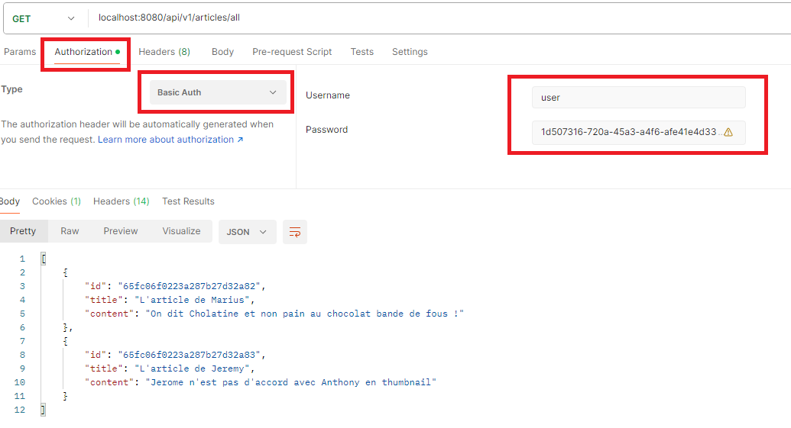

# Authentification par défaut

Par défaut, avec Spring Boot 3.2.5, Spring Security sécurise les URL REST en utilisant BasicAuth.

- L'identifiant par défaut est : user
- Le mot de passe est généré par défaut dans la console en mode développement

Cela signifie qu'à chaque requête, vous devrez envoyer les paramètres d'authentification dans l'en-tête Authorization à l'aide de votre outil préféré (Postman, Insomnia, Swagger, etc.)

## Exemple

