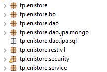
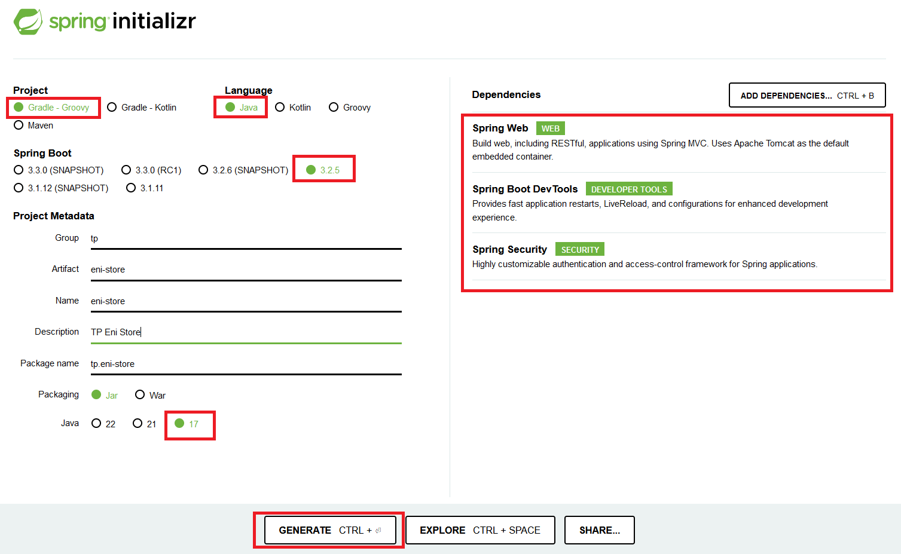
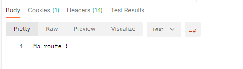
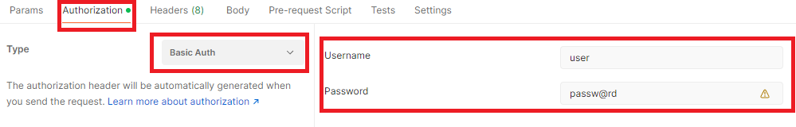

# TP Article API (Partie 1)

> **Note:** Avant de démarrer ce TP, il convient d’avoir suivi les vidéos des modules 1 à 2 et d’avoir réalisé les TP proposés.

**Durée Estimée : 1H**

## Enonce

Dans un premier temps, nous allons mettre en place le projet avec au moins une route qui retourne un message de test, ainsi que la configuration nécessaire pour avoir un mot de passe de développement par défaut sur Spring Security

## Arborescence

Vous pouvez déjà créer ces sous-packages pour préparer la structure de votre projet.

### Procédure d'initialisation du projet

Pour creer le projet vous pouvez suivre ces etapes 

#### Spring Initializr

Configurer votre projet via cette URL :  https://start.spring.io/

Après le téléchargement, décompressez le projet en dehors de workspace (attention surtout si vous utilisez Eclipse !)

:::warning N'allez pas trop vite !

Ce projet est un projet Gradle, il faut l'importer selon les bonnes pratiques dans Eclipse

:::

#### Import Gradle Project

Sur Eclipse : File -> Import -> Existing Gradle Project

Le chemin sera la racine du projet téléchargé décompressé.

## L'url

A la fin du TP, il faut que cette url fonctionne (via Postman par exemple) :

`http://localhost:8080/api/v1/articles/`

Le resultat affiché :

:::warning NE PAS OUBLIER

Attention tout requete rest demande l'authentification Basic Auth !
Par exemple dans mon cas:

:::

