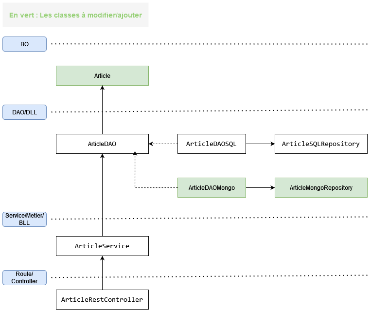

# TP Article API (Partie 3)

> **Note:** Avant de démarrer ce TP, il convient d’avoir suivi les vidéos des modules 1 à 3 et d’avoir réalisé les TP proposés.

**Durée Estimée : 1H**

## Enonce

Nous allons réaliser la même tâche que dans le TP précédent, mais cette fois-ci pour la version MongoDB, afin de compléter l'abstraction SQL et de permettre la possibilité de basculer entre les bases de données

Il sera nécessaire de créer les éléments suivants :

- **ArticleDAOMongo** : L'implémentation de l'interface ArticleDAO qui utilisera les données NoSQL (MongoDB)
- **ArticleMongoRepository** : Le repository JPA pour l'abstraction des requêtes NoSQL (héritage **MongoRepository**)

Il sera nécessaire de modifier les éléments suivants :

- **Article** : Au moins les annotations MongoDB

:::warning Rappel

- Il faudra utiliser les profils Spring pour pouvoir basculer entre les DAO (MongoDB/SQL)
- N'oubliez pas de configurer le fichier application.properties/yml pour établir correctement la connexion avec votre base de données.

:::

## Architecture visuelle

## Tester

Pour tester les routes, vous pouvez importer ces données MongoDB :

<a target="_blank" href="/res/db_article.articles.json" download="db_article.articles.json">Download</a>
