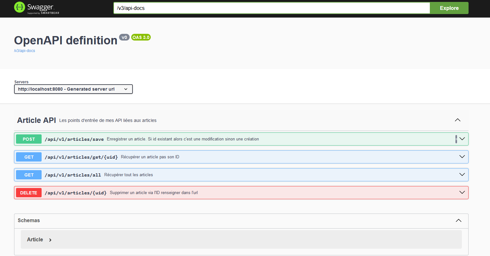

# TP Eni Store API (Partie 5)

> **Note:** Avant de démarrer ce TP, il convient d’avoir suivi les modules 1 à 4 et le module Swagger (07) et d’avoir réalisé les TP proposés.

**Durée Estimée : 30min**

## Enonce

Avant d'aller plus loin (JWT et Refactoring de toutes les routes et fonctionnalités), vous allez mettre en place Swagger avec springdoc.

En vous basant sur la démo, vous allez installer Swagger et documenter vos routes.

Vous êtes libre d'ajouter les commentaires/informations souhaités dans la documentation de chaque route, tant que cela reste cohérent. 

:::warning Rappel

Il peut être nécessaire de modifier le fichier gradle et le fichier application.properties pour la mise en place de Swagger

:::

## Exemple de résultat attendu

