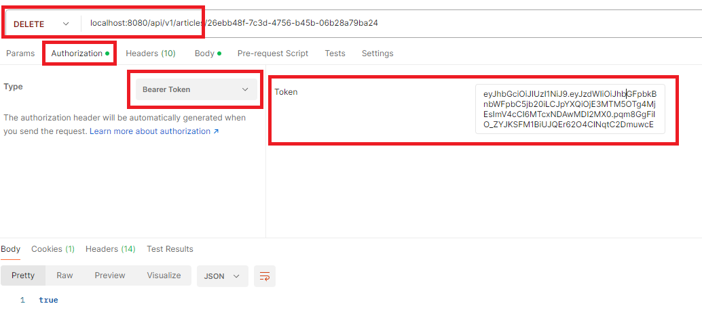

# TP Eni Store API (Partie 7)

> **Note:** Avant de démarrer ce TP, il convient d’avoir suivi les modules 1 à 6 d’avoir réalisé les TP proposés.

**Durée Estimée : 1-2h**

## Enonce

Vous allez vous baser sur la démo pour mettre en place le système JWT. Il y'a pas mal de classe à créer et un peu de configuration Spring Security à faire alors soyez attentif lorsque vous repliqué la Demo sur le TP.

Etant donné que nous n'utilisons plus BasicAuth il faut supprimer le code qui authentifiais l'user en BasicAuth

:::warning Être minutieux

Il ne faut pas se perdre dans les classes et les méthodes. Soyez extrêmement attentif, prenez votre temps pour relire et ne pas oublier les annotations et les noms de fonction à peut-être adapter !

La majorité des erreurs que vous allez rencontrer seront de cet ordre !

:::

## Pour tester

Une fois terminé pour tester vous pourrez :

### Vous connecter pour récupérer le token :

### Supprimer un article en s'authentifiant via le token récupéré :

