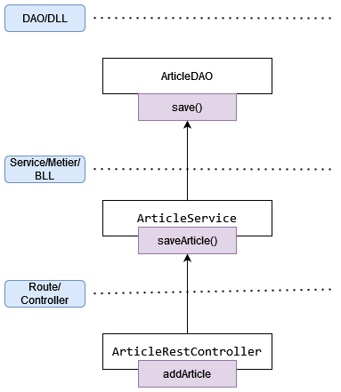

# TP Eni Store API (Partie 4)

> **Note:** Avant de démarrer ce TP, il convient d’avoir suivi les modules 1 à 4 et d’avoir réalisé les TP proposés.

**Durée Estimée : 1H**

## Enonce

Toujours en restant sur l'implémentation **MongoDB**, nous allons compléter les opérations CRUD comme suit :

- La possibilité de créer un article
- La capacité de modifier un article
- Compléter la suppression avec l'annotation `@DeleteMapping`

:::warning Rappel

On reste sur l'implémentation **MongoDB** pour l'instant afin de ne pas complexifier le TP. L'objectif est de comprendre l'architecture, quelle que soit l'implémentation.

L'achèvement de l'implémentation **MySQL** pourrait être envisagé uniquement en fin de semaine pour finaliser le projet

:::

## Ajouter un Article

## Editer un Article

:::warning Spring Security

N'oubliez pas de compléter la configuration de **CORS** et **CSRF**, comme dans la démo, pour tester facilement votre TP en localhost

:::