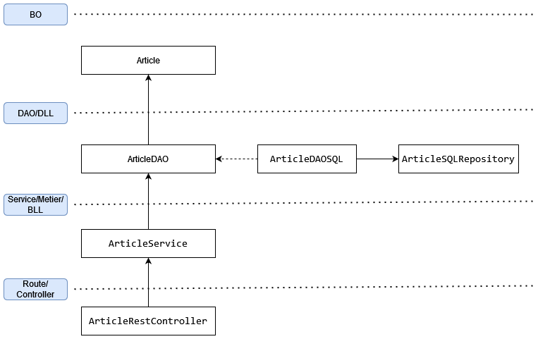

# TP Eni Store API - MongoDB (Partie 2)

> **Note:** Avant de démarrer ce TP, il convient d’avoir suivi les modules 1 à 2 et d’avoir réalisé les TP proposés.

**Durée Estimée : 1H-2H**

## Enonce

Nous allons réaliser un CRUD sur le modèle Article (à l'exception du POST).

Il sera nécessaire de créer les éléments suivants :

- **Article** : La classe **Article** dans le package **BO**
- **ArticleDAO** : L'interface DAO Article pour le CRUD (findAll, findById, delete)
- **ArticleDAOMongo** : L'implémentation de l'interface **ArticleDAO** qui utilisera les données **NoSQL**
- **ArticleMongoRepository** : Le repository Mongo pour l'abstraction des requêtes **NoSQL**
- **ArticleService** : La couche métier (ou service/BLL) qui fera appel à la **DAO**
- **ArticleRestController** : Ce contrôleur contiendra les **routes API** pour le CRUD d'un article (donc 4 routes)

Un article contient au moins:
- Id (String)
- Title

:::warning Rappel

- N'oubliez pas de configurer le fichier application.properties/yml pour établir correctement la connexion avec votre base de données.

- Il faut installer dépendances mongodb sur build.gradle

:::

## Architecture visuelle

Attention pour le moment vous remplacez **ArticleDAOSQL** par **ArticleDAOMongo**, pareil pour **ArticleSQLRepository**, c'est juste un schéma d'architecture (utilisé plus tard)

## Tester

Pour tester les routes, vous devrez insérer 2 à 3 articles en base de données