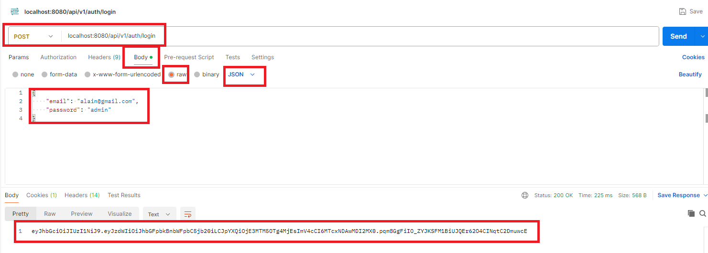

# TP Eni Store API (Partie 7 - JWT Filter)

> **Prérequis** : Avoir complété les TP précédents.

**Durée estimée : 1h à 2h**

## Énoncé

Dans cette partie, vous allez mettre en place le système **JWT** en vous basant sur la démo.  
Cela implique la création de plusieurs classes et l’ajout de configurations spécifiques dans **Spring Security**.

Soyez attentifs lors de la reproduction de la démo afin d’éviter les erreurs.

:::warning Attention
Il est essentiel de rester rigoureux dans la création des classes et des méthodes.
- Relisez attentivement votre code
- Vérifiez les annotations
- Assurez-vous que les noms de fonctions sont correctement adaptés

La majorité des erreurs rencontrées dans ce TP sont dues à des oublis ou des imprécisions.
:::

### Protéger une route

Nous allons également en profiter pour restreindre l'accès à toutes les routes sauf l'url pour se connecter (donc l'url pour générer le token)

## Pour tester

Une fois terminé pour tester vous pourrez :

### Vous connecter pour récupérer le token :

