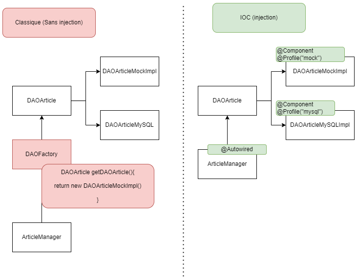

# Injection

Voici un exemple d'implémentation DAO sans utilisation d'injection et avec injection (utilisation du pattern IOC)



L'avantage du pattern IOC est qu'il vise à minimiser le couplage (et donc à réduire les dépendances fortes) tout en offrant une meilleure flexibilité en matière de configuration.

Cela permet de passer d'une implémentation à une autre sans avoir besoin de modifier le code source, mais plutôt en utilisant des fichiers de propriétés

## Spécifier des composants Injectables

Pour simplifier, pour définir une classe/interface **Injectable**, on peut utiliser les annotations suivantes :
- @Component
- @Service
- @Controller
- @Repository

## Récupérer une injection
Pour récupérer une injection on peut avoir 3 manières de faire à savoir :

#### Utiliser @Autowired

```java
@Autowired
DAOArticle daoArticle;
```

#### Injecter dans un constructeur

```java
DAOArticle daoArticle;
	
UnConstructeur(DAOArticle daoArticle) {
    this.daoArticle = daoArticle;
}
```

#### Injecter dans une fonction

```java
@Autowired
void uneFonction(DAOArticle daoArticle) {
    daoArticle.getAll();
}
```