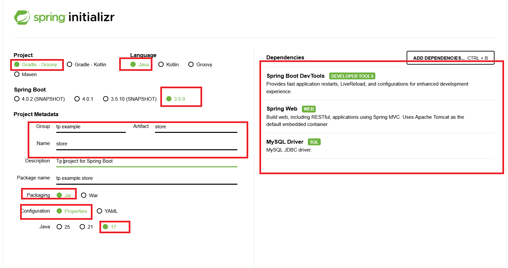

# TP Store API - Partie 1 Installation

**Durée Estimée : 1H**

## Enonce

Dans un premier temps, nous allons mettre en place le projet avec au moins une route qui retourne un message de test.

## Arborescence

Vous pouvez déjà créer ces sous-packages pour préparer la structure de votre projet.

```
- bo : Contient les classes modèles (exemple: Article)
- dao : Les classes pour la gestion des données MYSQL
- rest : Les classes et controllers API
```

### Procédure d'initialisation du projet

Pour créer le projet vous pouvez suivre ces etapes 

#### Spring Initializr

Configurer votre projet via cette URL :  https://start.spring.io/



Après le téléchargement, décompressez le projet et importez le sur Intellij.

:::warning N'allez pas trop vite !

Ce projet est un projet Gradle, n'oublie pas de rebuild le projet gradle avec l'icon Elephan sur Intellij

:::