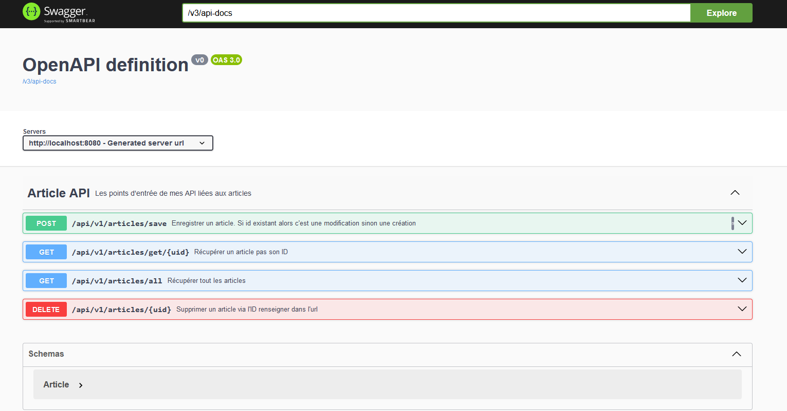

# TP Store API - Partie 5 Swagger

> **Prérequis** : Avoir complété les TP précédents.

**Durée estimée : 30 min**

## Énoncé

Dans cette partie, vous allez mettre en place **Swagger** avec **Springdoc**.

Vous devrez :
- Installer Swagger
- Documenter vos routes REST

Vous êtes libre d’ajouter les commentaires et informations souhaités dans la documentation de chaque route, tant que cela reste cohérent et utile.

Dependances Swagger: 

```
```

:::warning Rappel
Il peut être nécessaire de modifier le fichier **build.gradle** et le fichier **application.properties** pour configurer correctement Swagger.
:::

## Dépendance Gradle

Pour SpringDoc, ajoutez la dépendance suivante à votre projet :

```
implementation 'org.springdoc:springdoc-openapi-starter-webmvc-ui:2.5.0'
```

## Exemple de résultat attendu


