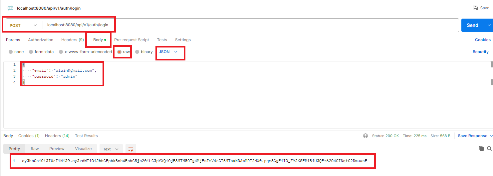

# TP Store API (Partie 6 - JWT)

> **Prérequis** : Avoir complété les TP précédents.

**Durée estimée : 1h à 2h**

## Énoncé

Dans cette partie, vous allez mettre en place le système **JWT**.

## Pour tester

Une fois terminé pour tester vous pourrez :

### Vous connecter pour récupérer le token :

### Tester que le token est valide

Créer une URL pour vérifier que le token est valide

PS: Pour le moment le token dans le paramètre de l'url

