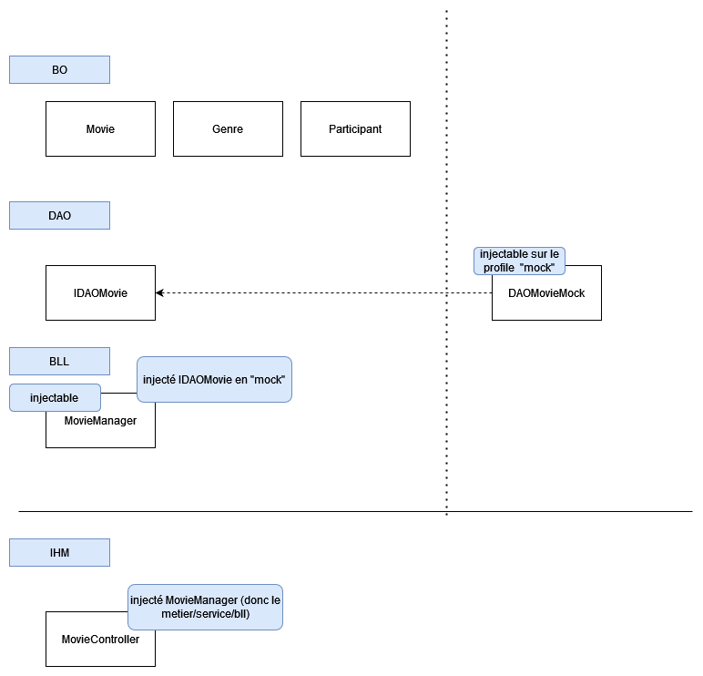
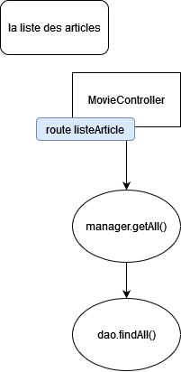

# TP Spring Web - Partie 02

## Priorité

Fonctionnalités :

- La page d'acceuil
- La page qui affiche la liste des Films
- La page qui affiche le détail d'un film


## CSS

Le CSS n'est pas obligatoire, vous pouvez utiliser le **framework CSS** de votre choix

:::info Note

Pour les **images** ou les fichiers *css/js** ils sont placé dans le dossier **static**

Le dossier **static** est la racine des assets

:::

Exemple pour importer **mon-fichier.css** qui est à la racine de **static**

```html
<link rel="stylesheet" href="mon-fichier.css" />
```

## Etapes

- Compléter la BO (donc les classes)
- Compléter l'interface **IDAOMovie** (pour que le bouchon fonctionne)
- Créer la **DAOMock** (bouchon) qui implémente **IDAOMovie**
- Compléter le **ArticleManager** (il aura les méthodes pour récupérer les données de la DAO)
- Compléter le **Controller** avec les routes nécessaires

:::danger Important

Ne pas oublier de bien utiliser les bonnes annotations pour l'injection

:::

### Le detail du Film

Pas de formulaire, uniquement afficher les informations en tant que consultation

Faire abstraction des **Avis** (pas pour maintenant)

## Rappel architecture



### Exemple pour la liste des films

