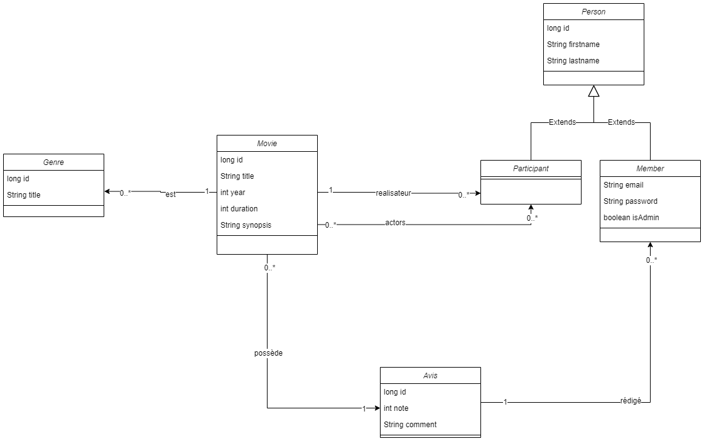
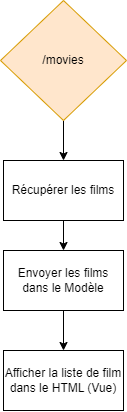

# TP Spring Web - Partie 02

> **Durée Estimée : 1-2h**

## Enoncé

 Fonctionnalités :

- La page d'accueil
- La page qui affiche la liste des films
- La page qui affiche le détail d'un film

Commencez par créer les 3 pages vides avec uniquement un titre et un paragraphe 'todo'

## CSS

Le CSS n'est pas obligatoire, vous pouvez utiliser le **framework CSS** de votre choix

:::info Note

Pour les **images** ou les fichiers **css/js** ils sont placés dans le dossier **static**

Le dossier **static** est la racine des **assets/ressources**

:::

Exemple pour importer **mon-fichier.css** qui est à la racine de **static**

```html
<link rel="stylesheet" href="mon-fichier.css" />
```

## Diagram

Pour le moment vous allez vous concentrer uniquement sur **Movie** et si vous êtes à l'aise sur ces associations à part **avis** et **actors**



## Etapes

- Compléter la BO, donc le(s) classe(s)
- Compléter l'interface **IDAOMovie** (pour que le bouchon fonctionne)
- Créer la **DAOMock** (bouchon) qui implémente **IDAOMovie**
- Compléter le **ArticleManager** (il aura les méthodes pour récupérer les données de la DAO)
- Compléter le **Controller** avec les routes nécessaires

:::danger Important

Ne pas oublier de bien utiliser les bonnes annotations pour l'injection

:::

### La liste des films

Diagram processus :



Globalement, d'un point de vue technique, voici une vue d'ensemble de ce qui peut se passer entre les couches IHM, BLL et DAO


### Le detail du Film

Pas de formulaire, uniquement afficher les informations en tant que consultation

Faire abstraction des **Avis** (pas pour maintenant)


## Rappel architecture


