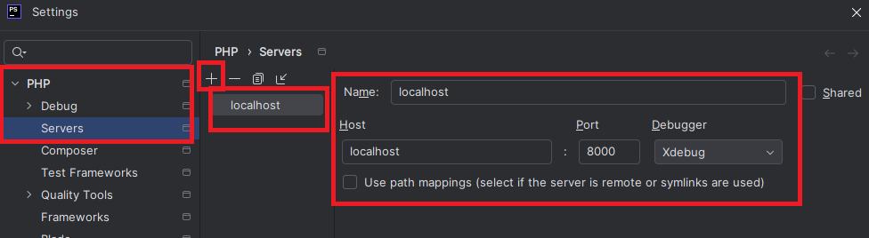
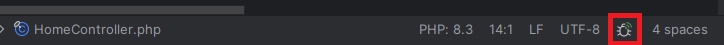
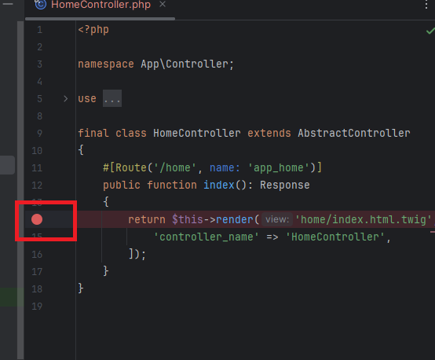

# Debugger sur l'IDE

Il est important de pouvoir déboguer une application Symfony et d'utiliser les breakpoints (points d'arrêt).

Dans cette page, nous allons voir comment l'utiliser dans le cadre où l'on lance un serveur Symfony dans l'application.

## Prérequis

- On suppose que XDebug est déjà activé dans votre installation PHP.

## Configurer l'IDE

Il faut ajouter un serveur à écouter, comme ceci :

Ensuite, lorsque vous souhaiterez placer des points d'arrêt pour déboguer, il ne faudra pas oublier d’activer  
l'écoute du débogueur via l’icône en forme d’insecte en bas à droite :

### Ajouter un point d'arrêt

Il ne reste plus qu'à ajouter un point d’arrêt à l’endroit où vous souhaitez déboguer.

